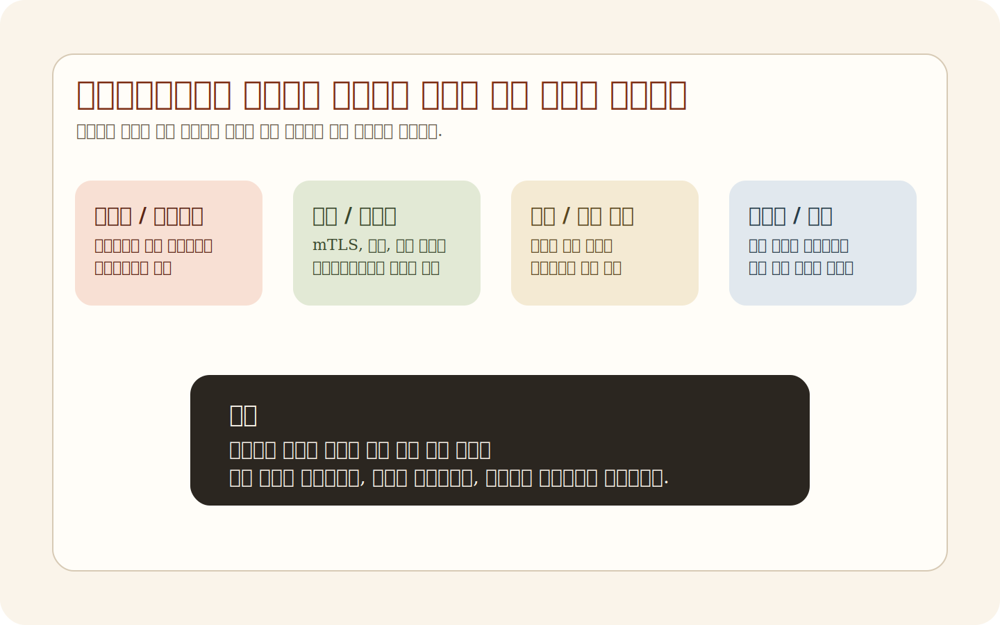
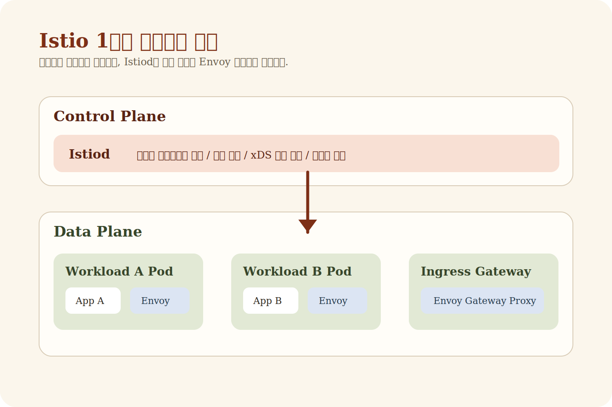
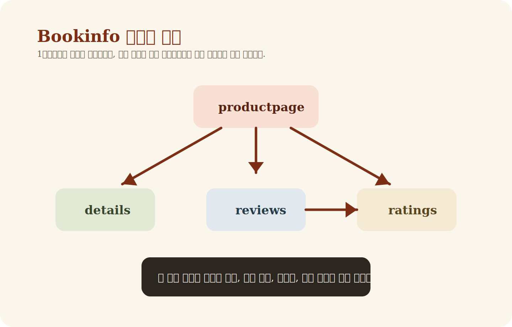
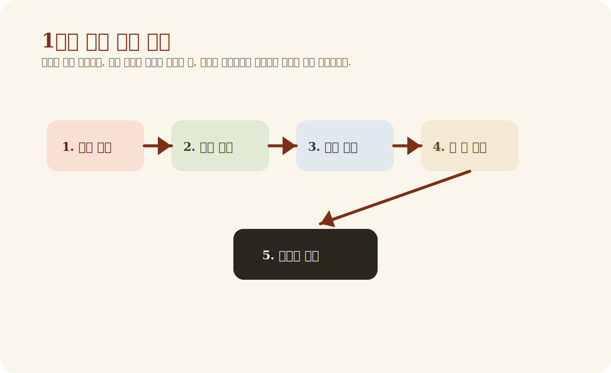

# Week 1. 왜 Istio가 필요한가, 그리고 첫걸음은 무엇인가

1주차는 설치 명령을 외우는 주가 아니다.  
정말 중요한 건 `왜 Istio가 필요한지`, `Service Mesh가 무엇을 해결하려는지`, `Envoy와 Istiod가 어떤 역할을 하는지`, 그리고 `첫 애플리케이션을 메시에 올리면 무엇이 달라지는지`를 이해하는 것이다.

이 글은 Notion 스터디와 참여자 블로그, Istio 공식 문서를 바탕으로 1주차 내용을 다시 쓴 `블로그형 학습 글`이다.  
링크를 여러 개 열지 않아도, 이 글 하나로 1주차의 큰 흐름을 잡을 수 있게 구성했다.

---

## 목차

1. [왜 마이크로서비스 환경에서 네트워크 문제가 커지는가](#왜-마이크로서비스-환경에서-네트워크-문제가-커지는가)
2. [Service Mesh는 무엇을 바깥으로 끌어내는가](#service-mesh는-무엇을-바깥으로-끌어내는가)
3. [Envoy는 왜 그렇게 중요한가](#envoy는-왜-그렇게-중요한가)
4. [Istio 아키텍처를 1주차 수준에서 이해하기](#istio-아키텍처를-1주차-수준에서-이해하기)
5. [사이드카 주입은 왜 핵심인가](#사이드카-주입은-왜-핵심인가)
6. [왜 Bookinfo를 첫 예제로 쓰는가](#왜-bookinfo를-첫-예제로-쓰는가)
7. [1주차 실습은 어디까지 해야 하는가](#1주차-실습은-어디까지-해야-하는가)
8. [추천 읽기 순서](#추천-읽기-순서)
9. [1주차에서 자주 생기는 오해](#1주차에서-자주-생기는-오해)
10. [1주차 종료 체크리스트](#1주차-종료-체크리스트)
11. [참고 자료](#참고-자료)

---

## 왜 마이크로서비스 환경에서 네트워크 문제가 커지는가

모놀리식 애플리케이션에서는 많은 호출이 프로세스 내부에서 끝난다. 함수 호출과 메모리 접근이 중심이기 때문에, 네트워크는 상대적으로 단순한 계층으로 남아 있다.

그런데 마이크로서비스 구조로 넘어가면 하나의 사용자 요청이 여러 서비스 호출로 쪼개진다. 그 순간부터 문제의 성격이 달라진다.

- 서비스 A가 서비스 B를 호출한다
- 서비스 B는 다시 서비스 C와 D를 호출한다
- 호출이 깊어질수록 지연 시간과 실패 가능성이 커진다
- 어떤 서비스가 느려졌는지, 어느 구간에서 실패했는지 추적하기 어려워진다

즉, 마이크로서비스는 기능을 잘게 나누는 대신 `네트워크를 시스템의 핵심 문제`로 끌어올린다.

이때 보통 이런 요구가 동시에 생긴다.

- 타임아웃은 얼마로 둘 것인가
- 실패하면 몇 번 재시도할 것인가
- 어느 버전으로 몇 퍼센트 트래픽을 보낼 것인가
- 서비스 간 통신은 어떻게 암호화할 것인가
- 호출 경로는 어떻게 추적할 것인가

문제는 이걸 각 서비스 코드 안에 넣기 시작하면, 같은 기능을 언어와 프레임워크마다 반복 구현하게 된다는 점이다.



결국 운영팀 입장에서는 아래와 같은 상태가 된다.

- 재시도 정책은 Java 서비스와 Go 서비스가 다름
- 인증 방식은 팀마다 다름
- 메트릭 이름도 제각각임
- 배포 전략도 서비스마다 다르게 구현됨

이런 상황에서는 애플리케이션은 분리됐지만, 운영 품질은 오히려 통제하기 어려워진다.

---

## Service Mesh는 무엇을 바깥으로 끌어내는가

Service Mesh의 핵심은 간단하다.

> 서비스 간 통신에서 반복되는 공통 기능을 애플리케이션 코드 밖으로 빼낸다.

여기서 공통 기능이란 다음 같은 것들이다.

- 로드 밸런싱
- 재시도
- 타임아웃
- 회로 차단
- TLS 암호화
- 서비스 간 인증
- 메트릭 수집
- 분산 추적

이 기능들은 중요하지만, 비즈니스 로직 그 자체는 아니다.  
그래서 애플리케이션 코드가 아니라 `인프라 계층`이 맡는 편이 훨씬 일관되고 관리 가능하다.

Service Mesh는 보통 이런 방식으로 동작한다.

1. 서비스 옆에 프록시를 둔다
2. 서비스 간 통신이 그 프록시를 통과하게 만든다
3. 중앙 제어면이 프록시에 정책을 내려준다
4. 운영 정책을 코드가 아니라 리소스로 관리한다

여기서 중요한 건, Service Mesh는 서비스 호출을 없애는 기술이 아니라 `서비스 호출을 통제 가능한 대상으로 바꾸는 기술`이라는 점이다.

---

## Envoy는 왜 그렇게 중요한가

1주차 자료를 읽다 보면 거의 모든 설명이 Envoy로 수렴한다. 그 이유는 간단하다.  
Istio에서 실제 트래픽을 다루는 데이터 플레인의 핵심이 Envoy이기 때문이다.

Envoy는 단순한 프록시가 아니다. 다음 같은 기능을 실제로 수행한다.

- 요청을 어느 서비스 버전으로 보낼지 결정
- 재시도와 타임아웃 집행
- TLS 연결 수행
- 메트릭과 트레이싱 정보 생성
- 정책에 따라 요청 차단 또는 허용

즉, Istio 리소스는 선언이고, Envoy는 실행기다.

초심자 입장에서는 YAML이 더 눈에 띄기 때문에 `VirtualService`나 `DestinationRule`만 중요해 보일 수 있다. 하지만 실제 요청을 받아 처리하는 주체는 Envoy다. 이 관점을 잡지 못하면 이후 주차에서 계속 헷갈리게 된다.

---

## Istio 아키텍처를 1주차 수준에서 이해하기

1주차에서는 아키텍처를 너무 복잡하게 외울 필요가 없다.  
우선 `control plane`과 `data plane`만 분리해 이해하면 충분하다.

### Control Plane

Istiod가 중심이다.

- 서비스 디스커버리 정보를 읽는다
- 사용자가 작성한 Istio 리소스를 해석한다
- 각 프록시에 필요한 설정을 생성한다
- 그 설정을 Envoy에 배포한다

### Data Plane

실제 트래픽을 처리하는 Envoy 프록시 집합이다.

- 서비스 옆의 sidecar Envoy
- Ingress Gateway의 Envoy

아래 도식으로 보면 이해가 가장 쉽다.



1주차 관점에서 흐름은 이 네 줄이면 충분하다.

1. 사용자가 애플리케이션과 Istio 설정을 Kubernetes에 배포한다
2. Istiod가 이를 읽고 해석한다
3. 각 Envoy에 필요한 설정을 만든다
4. Envoy가 실제 요청을 그 정책대로 처리한다

이 흐름이 머리에 들어오면, 뒤에서 나오는 라우팅과 보안 리소스가 훨씬 이해하기 쉬워진다.

---

## 사이드카 주입은 왜 핵심인가

Istio의 전통적인 데이터 플레인 모델은 `사이드카`다.  
즉, 애플리케이션 파드 옆에 Envoy 컨테이너를 하나 더 붙이는 방식이다.

이게 중요한 이유는 분명하다.

- 애플리케이션 수정 없이 메시 기능을 적용할 수 있다
- 각 워크로드 단위로 정책을 세밀하게 적용할 수 있다
- 모든 트래픽을 프록시가 볼 수 있게 된다

하지만 비용도 있다.

- 파드마다 프록시가 붙으니 리소스 사용량이 늘어난다
- 운영 복잡도가 증가한다
- 업그레이드 범위가 커진다

즉, 사이드카는 Istio의 강점이면서 동시에 부담이기도 하다.  
나중에 Ambient Mesh가 등장하는 이유도 결국 이 비용 문제를 어떻게 줄일 것인가와 연결된다.

1주차에서는 다음 한 문장으로 기억하면 된다.

> 사이드카 주입은 Istio가 애플리케이션 코드 변경 없이 네트워크 정책을 적용할 수 있게 만드는 핵심 메커니즘이다.

---

## 왜 Bookinfo를 첫 예제로 쓰는가

Bookinfo는 이후 거의 모든 주차에서 다시 등장하는 공통 실험장이다.  
이 앱이 좋은 이유는 구조가 단순하면서도 메시 기능을 실험하기에 충분히 풍부하기 때문이다.

구성은 대략 이렇게 이해하면 된다.

- `productpage`: 사용자 진입점
- `details`: 상품 상세 정보
- `reviews`: 리뷰 정보
- `ratings`: 평점 정보

여기서 중요한 건 단순히 서비스를 띄우는 것이 아니다.

- 어떤 서비스가 어떤 서비스를 호출하는가
- reviews가 왜 여러 버전을 가질 수 있는가
- 트래픽 분할 실험이 왜 가능한가
- 관측성과 보안 실습이 왜 여기서 잘 되는가



1주차에서 최소한 이 정도는 설명할 수 있어야 한다.

- productpage가 백엔드 서비스들을 호출한다
- reviews와 ratings의 관계가 있다
- 이후 주차에서 라우팅, 장애 주입, 관측성, 보안 정책을 같은 앱으로 계속 실험할 수 있다

---

## 1주차 실습은 어디까지 해야 하는가

1주차 실습은 욕심내지 않는 게 중요하다.  
여기서 보안 정책과 트래픽 미러링까지 다 하려고 하면 흐름이 무너진다.

1주차 목표는 딱 여기까지다.

1. 로컬 클러스터를 준비한다
2. Istio를 설치한다
3. Bookinfo를 배포한다
4. 외부에서 Bookinfo에 접속한다
5. 사이드카와 기본 메시 구조를 확인한다

실습 파일은 여기만 보면 된다.

- [`week1/practice/kind-config.yaml`](../week1/practice/kind-config.yaml)
- [`week1/practice/install-istio-demo.sh`](../week1/practice/install-istio-demo.sh)
- [`week1/practice/bookinfo.yaml`](../week1/practice/bookinfo.yaml)
- [`week1/practice/bookinfo-gateway.yaml`](../week1/practice/bookinfo-gateway.yaml)
- [`week1/practice/destination-rule-all.yaml`](../week1/practice/destination-rule-all.yaml)

예를 들어 실습 흐름은 이런 식이다.

```bash
cd week1/practice

# 1. kind 클러스터 생성
kind create cluster --name istio-study --config kind-config.yaml

# 2. Istio 설치
./install-istio-demo.sh

# 3. Bookinfo 배포
kubectl apply -f bookinfo.yaml

# 4. Gateway / DestinationRule 적용
kubectl apply -f bookinfo-gateway.yaml
kubectl apply -f destination-rule-all.yaml
```

중요한 건 명령어를 그대로 따라치는 것이 아니라, `왜 이런 순서로 하는지`를 이해하는 것이다.

- 먼저 클러스터가 있어야 하고
- 그 다음 control plane을 설치해야 하며
- 그 위에 애플리케이션을 배포하고
- 마지막으로 외부 진입과 라우팅 구성을 붙인다

---

## 추천 읽기 순서

1주차 자료를 아무 순서로나 읽으면 오히려 더 헷갈린다.  
가장 덜 헷갈리는 순서는 다음과 같다.



### 1. 배경 이해

- 왜 마이크로서비스 환경에서 네트워크가 어려워지는가
- 왜 공통 네트워크 기능을 코드 밖으로 빼야 하는가

### 2. 공식 개념 보정

- Istio Overview 기준으로 control plane / data plane / sidecar 개념 정리

### 3. 실습 환경 이해

- kind
- istioctl
- demo 프로파일 설치 흐름

### 4. 첫 애플리케이션 배포

- Bookinfo 배포
- 사이드카 주입 확인
- Gateway 연결

### 5. 예고편 수준의 복습

1주차 자료에 observability, resiliency, traffic routing 이야기가 조금 나온다.  
하지만 이걸 1주차에 끝내려 하면 과해진다. 존재만 파악하고 넘어가는 것이 맞다.

---

## 1주차에서 자주 생기는 오해

### Istio는 그냥 Ingress 툴 아닌가

아니다. Ingress Gateway는 겉으로 잘 보이는 일부일 뿐이다.  
Istio의 핵심은 서비스 간 통신을 플랫폼 차원에서 통제한다는 점이다.

### 사이드카만 붙이면 자동으로 다 해결되나

아니다. 사이드카는 기반일 뿐이다.  
실제 정책은 이후 배우게 되는 라우팅, 보안, 관측성 리소스로 명시해야 한다.

### 1주차에서 observability, resiliency, routing까지 다 마스터해야 하나

아니다. 1주차에서는 “아, Istio가 이런 기능까지 줄 수 있구나” 정도만 잡아도 충분하다.

---

## 1주차 종료 체크리스트

아래 질문에 답할 수 있으면 1주차는 성공이다.

- Service Mesh가 왜 필요한가
- Envoy는 실제로 어떤 역할을 하는가
- Istiod는 무엇을 하는가
- control plane과 data plane의 차이는 무엇인가
- sidecar injection은 왜 필요한가
- Bookinfo는 왜 반복해서 쓰는 예제인가

체크리스트로 보면 이렇다.

- [ ] Service Mesh의 필요성을 설명할 수 있다
- [ ] Envoy와 Istiod의 역할을 구분할 수 있다
- [ ] control plane과 data plane을 구분할 수 있다
- [ ] 사이드카 주입의 의미를 설명할 수 있다
- [ ] Bookinfo 구조를 말할 수 있다
- [ ] 2주차로 왜 Envoy와 Gateway가 이어지는지 이해한다

---

## 참고 자료

세부 참고 링크는 별도 파일로 정리했다.

- [1주차 참고 링크 모음](../references/week1-links.md)

핵심 기준은 다음 세 축이다.

- Notion 스터디 구조
- 참여자 블로그의 1주차 정리
- Istio 공식 문서

---

## 마무리

1주차는 설치법 자체보다 `문제의 구조`를 이해하는 주다.  
Istio를 쓰는 이유를 이해하지 못한 채 리소스 이름만 외우기 시작하면, 다음 주차부터는 거의 반드시 막힌다.

반대로 1주차에서 아래만 분명히 잡으면 이후 흐름은 훨씬 안정적이다.

- 왜 메시가 필요한가
- Envoy는 실행기다
- Istiod는 제어면이다
- 사이드카는 Istio의 핵심 메커니즘이다
- Bookinfo는 이후 실습의 공통 실험장이다

그 다음 단계는 이 글을 읽고 직접 `week1/practice/`를 따라가면서,
파드에 사이드카가 붙는 순간과 Bookinfo 요청 흐름을 눈으로 확인하는 것이다.
