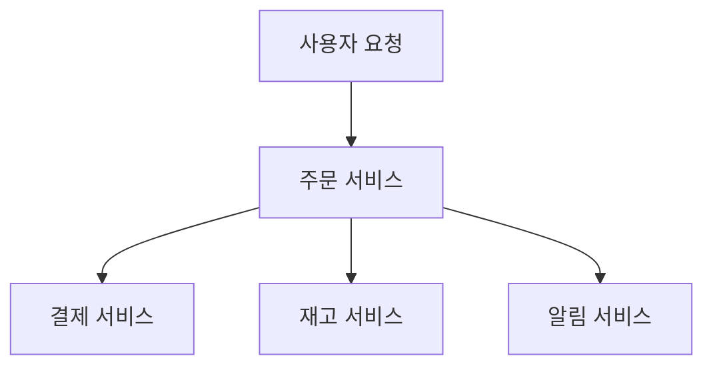
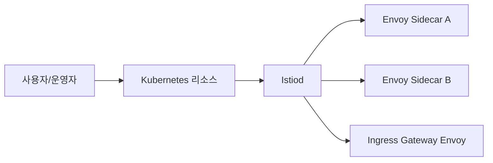
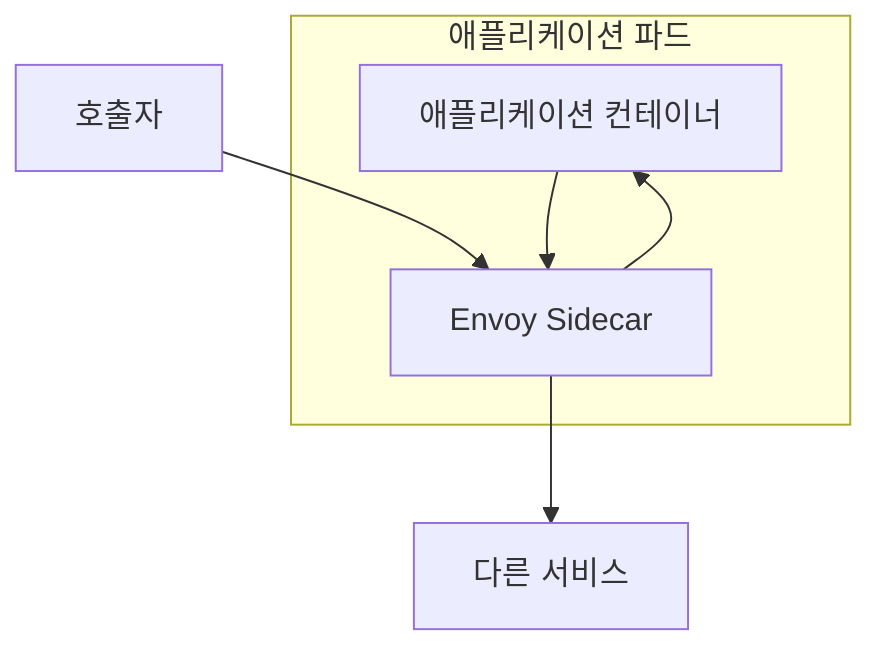
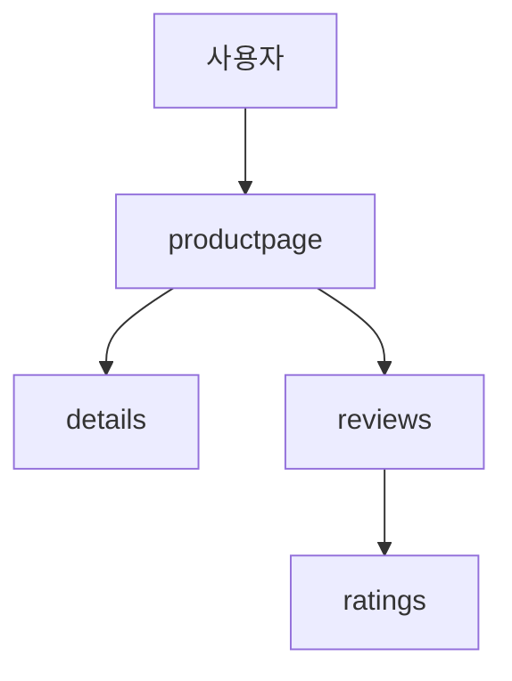

# Week 1. 왜 Istio가 필요한가, 그리고 첫걸음은 어디서 시작해야 하는가

1주차는 보통 `Istio 설치`, `Bookinfo 배포`, `Gateway 연결` 같은 키워드로 기억된다.  
하지만 1주차의 진짜 목적은 설치 성공 자체가 아니다. 핵심은 아래 질문에 답하는 것이다.

- 왜 마이크로서비스 환경에서 네트워크가 별도 운영 문제로 떠오르는가
- Service Mesh는 정확히 무엇을 바꾸는가
- Istio는 어떤 구조로 그 문제를 다루는가
- Envoy와 Istiod는 각각 무엇을 담당하는가
- 왜 첫 실습 예제가 Bookinfo인가
- 1주차에서 어디까지 하고, 어디부터는 다음 주차로 넘겨야 하는가

이 글은 공개 접근 가능한 자료를 다시 대조해서 썼다.

- Notion의 주차 구조
- `kschoi728`의 1주차 시리즈
- `kimdoky`의 week1 정리
- 최신 `Istio` 공식 문서

즉, 한 사람의 글을 요약한 것이 아니라 `여러 소스를 섞어 다시 쓴 1주차 통합 정리`다.  
또 설치나 버전처럼 바뀔 수 있는 부분은 공식 문서 기준으로 다시 검수해 보수적으로 설명했다.

---

## 목차

1. [1주차를 어떤 관점으로 봐야 하는가](#1주차를-어떤-관점으로-봐야-하는가)
2. [왜 마이크로서비스는 결국 네트워크 운영 문제로 간다](#왜-마이크로서비스는-결국-네트워크-운영-문제로-간다)
3. [Service Mesh는 무엇을 애플리케이션 밖으로 꺼내는가](#service-mesh는-무엇을-애플리케이션-밖으로-꺼내는가)
4. [Istio를 1주차 수준에서 어떻게 이해하면 좋은가](#istio를-1주차-수준에서-어떻게-이해하면-좋은가)
5. [Envoy는 왜 Istio의 핵심 실행기인가](#envoy는-왜-istio의-핵심-실행기인가)
6. [Istiod는 정확히 무엇을 하는가](#istiod는-정확히-무엇을-하는가)
7. [Sidecar Injection은 왜 중요하고 동시에 부담이 되는가](#sidecar-injection은-왜-중요하고-동시에-부담이-되는가)
8. [Bookinfo를 왜 첫 실습으로 쓰는가](#bookinfo를-왜-첫-실습으로-쓰는가)
9. [1주차 실습은 어디까지 해야 하는가](#1주차-실습은-어디까지-해야-하는가)
10. [1주차 자료를 읽는 추천 순서](#1주차-자료를-읽는-추천-순서)
11. [1주차에서 자주 생기는 오해](#1주차에서-자주-생기는-오해)
12. [1주차 종료 체크리스트](#1주차-종료-체크리스트)
13. [참고 자료와 검수 기준](#참고-자료와-검수-기준)

---

## 1주차를 어떤 관점으로 봐야 하는가

처음 Istio를 접하면 보통 이런 흐름으로 헷갈린다.

- 용어가 너무 많다
- Kubernetes 개념과 Istio 개념이 섞인다
- 실습 YAML은 따라 했는데 왜 필요한지는 모르겠다
- Gateway, sidecar, control plane, telemetry가 다 한꺼번에 나온다

그래서 1주차는 무조건 세 단계로 나눠서 봐야 한다.

1. **문제 이해**  
   왜 마이크로서비스 환경에서 통신이 운영 문제로 커지는지 이해한다.

2. **구조 이해**  
   Istio가 control plane과 data plane으로 나뉘며, Envoy와 Istiod가 각각 무엇을 맡는지 이해한다.

3. **경험 확인**  
   Bookinfo를 직접 띄워서, "아 이게 실제로 프록시를 붙이고 메시 구조를 만드는구나"를 눈으로 확인한다.

이 세 단계를 연결하지 못하면, 1주차는 설치만 했는데 남는 건 없는 상태가 된다.  
반대로 이 세 단계를 연결하면 이후 주차의 트래픽 제어, 관측성, 보안이 전부 한 줄로 이어진다.

---

## 왜 마이크로서비스는 결국 네트워크 운영 문제로 간다

모놀리식 애플리케이션에서는 호출의 상당수가 프로세스 내부에서 끝난다.  
함수 호출, 메모리 접근, 같은 런타임 안의 흐름이 중심이기 때문에 네트워크는 상대적으로 얇은 계층이다.

하지만 마이크로서비스 구조로 바뀌는 순간 문제가 달라진다.

- 하나의 사용자 요청이 여러 서비스 호출로 분해된다
- 서비스 A가 B를 호출하고, B가 다시 C와 D를 호출한다
- 각 호출마다 지연, 실패, 재시도, 인증, 관측성 문제가 생긴다
- 호출 깊이가 늘어날수록 장애 원인 추적이 어려워진다

예를 들어 주문 요청 하나가 아래처럼 흘러간다고 생각해보자.



여기서 단순히 서비스 수만 많아지는 것이 아니다.  
각 서비스가 네트워크 문제를 자기 방식대로 해결하기 시작하면 운영 복잡도가 폭발한다.

예를 들어:

- 주문 서비스는 타임아웃 2초
- 결제 서비스는 타임아웃 5초
- 재고 서비스는 재시도 3회
- 알림 서비스는 실패 시 큐 적재

보안도 제각각일 수 있다.

- 어떤 서비스는 TLS 사용
- 어떤 서비스는 내부망이니까 평문 통신
- 어떤 서비스는 JWT 검증
- 어떤 서비스는 서비스 계정만 신뢰

관측성도 마찬가지다.

- 어떤 서비스는 로그만 남김
- 어떤 서비스는 메트릭만 있음
- 어떤 서비스는 trace context를 전파하지 않음

즉, 마이크로서비스가 커질수록 "서비스 수" 자체보다 `서비스 간 통신을 어떻게 통제할 것인가`가 더 큰 문제가 된다.

### 왜 이것이 운영팀 문제로 바로 연결되는가

서비스가 3개일 때는 감으로도 관리된다.  
하지만 서비스가 20개, 50개, 100개가 되면 다음 질문이 생긴다.

- 공통 타임아웃 기준은 누가 정하는가
- 서비스 간 보안 통신은 누가 강제하는가
- 장애가 났을 때 어느 구간에서 실패했는지 어떻게 좁히는가
- 배포 시 일부 트래픽만 새 버전으로 보내는 정책은 누가 집행하는가

이 질문에 대한 답을 서비스 코드에만 맡기면, 결국 운영 정책이 코드 안에 흩어지게 된다.  
Service Mesh는 바로 이 지점을 겨냥한다.

---

## Service Mesh는 무엇을 애플리케이션 밖으로 꺼내는가

Service Mesh를 한 문장으로 요약하면 이렇다.

> 서비스 간 통신에서 반복되는 공통 네트워크 기능을 애플리케이션 코드 밖으로 분리해 플랫폼이 관리하게 만드는 구조

여기서 "공통 네트워크 기능"에는 보통 아래가 포함된다.

- 로드 밸런싱
- 재시도
- 타임아웃
- 회로 차단
- 트래픽 분할
- TLS 암호화
- 서비스 간 인증
- 접근 제어
- 메트릭 수집
- 분산 추적

### "코드 밖으로 뺀다"는 건 무슨 뜻인가

이 표현은 자주 오해된다.  
애플리케이션이 더 이상 네트워크를 몰라도 된다는 뜻은 아니다. 애플리케이션은 여전히 HTTP 호출과 도메인 로직을 처리해야 한다.

대신 아래 같은 `정책성 책임`을 애플리케이션 코드 밖으로 옮긴다는 뜻이다.

- 어느 업스트림으로 보낼지
- 언제 재시도할지
- 어느 버전으로 몇 퍼센트 보낼지
- 서비스 간 통신을 어떻게 암호화할지
- 어떤 워크로드가 어떤 워크로드를 호출할 수 있는지

즉, Service Mesh는 기능을 없애는 것이 아니라 `책임 위치를 이동시키는 것`이다.

### 왜 조직 규모가 커질수록 더 유리한가

작은 팀에서는 서비스마다 직접 구현해도 버틸 수 있다.  
하지만 조직이 커질수록 모든 팀이 동일한 수준의 네트워크 운영 역량을 가지기 어렵다.

Service Mesh는 플랫폼 레벨에서 최소 기준선을 만들어준다.

- 보안 통신의 기본값 통일
- 표준 메트릭 확보
- 공통 배포 정책 구성
- 공통 디버깅 루틴 확보

그래서 Istio는 "개발자 생산성 도구"라기보다, `플랫폼 운영 품질을 위한 도구`에 더 가깝다.

---

## Istio를 1주차 수준에서 어떻게 이해하면 좋은가

1주차에서는 세부 리소스를 외우기보다 큰 구조를 먼저 잡는 것이 맞다.  
가장 중요한 구분은 아래 둘이다.

- **Control Plane**
- **Data Plane**



1주차 관점에서 이걸 풀면 다음 네 줄이면 충분하다.

1. 사용자가 애플리케이션과 Istio 설정을 Kubernetes에 배포한다
2. Istiod가 그 정보를 읽고 해석한다
3. 각 Envoy 프록시에 필요한 설정을 만든다
4. 실제 요청은 Envoy가 그 설정대로 처리한다

즉, 사람은 선언하고, Istio는 해석하고, Envoy가 실행한다.

### 왜 이 구조를 먼저 잡아야 하는가

이 구조를 모르고 YAML부터 외우면 나중에 계속 막힌다.

- 라우팅 설정을 배워도 누가 집행하는지 모른다
- 보안 정책을 배워도 누가 강제하는지 모른다
- 메트릭이 나와도 누가 만드는지 모른다

반대로 이 구조를 알고 있으면 이후 주차의 개념들이 한 줄로 이어진다.

---

## Envoy는 왜 Istio의 핵심 실행기인가

여러 블로그를 보면 1주차부터 Envoy 설명이 반복된다. 그건 과장이 아니다.  
Istio에서 실제 트래픽을 다루는 데이터 플레인의 핵심이 Envoy이기 때문이다.

### Envoy를 "스마트 프록시"보다 조금 더 정확히 이해하기

Envoy를 단순 프록시라고만 생각하면 감이 덜 온다.  
오히려 `네트워크 정책을 실제로 집행하는 실행 런타임`으로 보는 편이 맞다.

예를 들어 이런 요구를 생각해보자.

- reviews v1에 90%, v2에 10% 보내기
- 5xx면 1회 재시도
- 3초가 지나면 타임아웃
- 서비스 간 통신은 항상 mTLS
- 특정 서비스만 특정 서비스 호출 허용

사람은 이걸 리소스로 선언하지만, 실제 요청에 그 규칙을 적용하는 순간은 Envoy에서 일어난다.

### Envoy가 담당하는 핵심 역할

- 인바운드 / 아웃바운드 트래픽 중개
- 라우팅 정책 적용
- 장애 대응 정책 실행
- 텔레메트리 생성
- 보안 통신 수행

즉, Istio 리소스는 선언이고 Envoy는 집행이다.

### 왜 2주차가 Envoy와 Gateway로 이어지는가

1주차에서 Envoy의 위치와 역할을 이해하면 2주차는 자연스럽다.  
왜냐하면 Gateway를 이해한다는 것은 결국 "외부 진입점에 위치한 Envoy는 무엇을 하는가"를 이해하는 것이기 때문이다.

---

## Istiod는 정확히 무엇을 하는가

입문자는 종종 `Istio = Envoy`처럼 받아들이거나, 반대로 `Istio = YAML`처럼 받아들인다.  
둘 다 반만 맞다. 그 사이를 연결하는 것이 Istiod다.

### 1주차에서 Istiod를 이렇게 이해하면 충분하다

- Kubernetes와 Istio 리소스를 읽는다
- 서비스 디스커버리 정보를 모은다
- 각 프록시에 맞는 설정을 만든다
- 그 설정을 프록시에 전달한다

조금 더 운영 관점으로 말하면, Istiod는 `정책 번역기 + 설정 배포기`에 가깝다.

사람이 읽기 쉬운 선언을 쓰면, Istiod는 그것을 프록시가 실제로 이해할 수 있는 구성으로 바꿔 배포한다.

### 왜 control plane을 별도로 구분해야 하는가

이 구분은 이후 디버깅에서 중요해진다.

- 설정이 잘못된 것인가
- 설정은 맞는데 프록시에 반영되지 않은 것인가
- 반영은 됐는데 실제 요청이 예상과 다르게 흐르는가

이 질문들은 control plane과 data plane을 구분해 생각해야 풀린다.  
즉, 1주차부터 이 감각을 가져가는 것이 좋다.

---

## Sidecar Injection은 왜 중요하고 동시에 부담이 되는가

Istio의 전통적인 데이터 플레인 모델은 `sidecar`다.  
애플리케이션 파드 옆에 Envoy 컨테이너를 하나 더 주입해 모든 서비스 트래픽을 프록시가 보게 만든다.



### 왜 이것이 강력한가

- 애플리케이션 수정 없이 메시 기능 적용 가능
- 워크로드 단위 세밀한 정책 적용 가능
- 인바운드와 아웃바운드 트래픽 모두 다룰 수 있음
- 보안과 관측성을 프록시 계층에서 공통 제공 가능

### 왜 이것이 운영 부담이 되기도 하는가

- 파드마다 프록시가 하나 더 붙는다
- CPU와 메모리 사용량이 증가한다
- 운영 복잡도가 올라간다
- 업그레이드 영향 범위가 커진다

즉, sidecar는 Istio의 핵심 강점이면서 동시에 운영 비용의 출발점이다.  
나중에 Ambient Mesh가 별도 주제가 되는 이유도 결국 이 비용을 어떻게 줄일 것인가와 연결된다.

### 1주차에서 꼭 직접 확인해야 하는 것

사이드카는 개념으로만 보면 안 된다.  
1주차 실습에서는 반드시 `파드 안에 컨테이너가 하나 더 들어갔는지`를 직접 확인해야 한다.

그걸 보는 순간 아래 사실이 명확해진다.

- Istio는 추상 개념이 아니라 실제 런타임 추가다
- 프록시가 붙는 순간부터 메시 기능이 가능해진다
- 그래서 기능과 비용이 동시에 생긴다

---

## Bookinfo를 왜 첫 실습으로 쓰는가

1주차에서 Bookinfo를 쓰는 이유는 단순히 유명한 데모라서가 아니다.  
이 앱은 이후 여러 주차를 관통하는 공통 실험장 역할을 한다.

구조는 단순하지만, 메시 기능을 시연하기엔 충분히 좋다.

- `productpage`: 사용자 진입점
- `details`: 상세 정보 서비스
- `reviews`: 리뷰 서비스
- `ratings`: 평점 서비스



### 왜 학습용 예제로 좋은가

- 호출 체인이 있다
- 서비스가 여러 개다
- 버전 분기 실험을 붙이기 좋다
- 화면으로 결과를 바로 확인할 수 있다

즉, "메시 기능이 눈에 보이는 앱"이라는 점이 중요하다.

### 1주차에서 Bookinfo를 볼 때 던져야 할 질문

- 사용자는 어디로 들어오는가
- productpage는 누구를 호출하는가
- reviews가 문제를 일으키면 화면은 어떻게 달라질까
- 이후 3주차에서 가중치 라우팅을 어디에 적용할 수 있을까

이 질문을 던지면서 보면 Bookinfo가 단순 샘플이 아니라 이후 실습의 공통 좌표처럼 보인다.

---

## 1주차 실습은 어디까지 해야 하는가

1주차 실습은 욕심을 줄이는 것이 중요하다.  
여기서 바로 고급 보안 정책이나 세밀한 트래픽 제어까지 들어가면 흐름이 무너진다.

1주차에서 해야 할 것은 딱 다섯 가지다.

1. 로컬 클러스터 준비
2. Istio 설치
3. Bookinfo 배포
4. 외부에서 Bookinfo 접근
5. 사이드카와 기본 메시 흐름 확인

### 실습 파일

- [`week1/practice/kind-config.yaml`](../week1/practice/kind-config.yaml)
- [`week1/practice/install-istio-demo.sh`](../week1/practice/install-istio-demo.sh)
- [`week1/practice/bookinfo.yaml`](../week1/practice/bookinfo.yaml)
- [`week1/practice/bookinfo-gateway.yaml`](../week1/practice/bookinfo-gateway.yaml)
- [`week1/practice/destination-rule-all.yaml`](../week1/practice/destination-rule-all.yaml)

### 기본 흐름

```bash
cd week1/practice

# 1. kind 클러스터 생성
kind create cluster --name istio-study --config kind-config.yaml

# 2. Istio 설치
./install-istio-demo.sh

# 3. Bookinfo 배포
kubectl apply -f bookinfo.yaml

# 4. Gateway / DestinationRule 적용
kubectl apply -f bookinfo-gateway.yaml
kubectl apply -f destination-rule-all.yaml
```

### 중요한 건 명령어가 아니라 순서다

- 먼저 클러스터가 있어야 한다
- 그다음 control plane이 올라와야 한다
- 그 위에 애플리케이션을 올린다
- 마지막으로 외부 진입과 기본 라우팅을 붙인다

즉, 실습 순서는 아키텍처 이해 순서와 맞물린다.

### 실습하면서 꼭 확인해야 하는 것

#### 1. Istio 시스템 파드 상태

```bash
kubectl get pods -n istio-system
```

#### 2. 애플리케이션 파드에 `istio-proxy`가 붙었는지

```bash
kubectl get pods
kubectl describe pod <pod-name>
```

#### 3. 서비스와 게이트웨이가 실제로 연결됐는지

```bash
kubectl get svc
kubectl get gateway,virtualservice
```

#### 4. 요청 경로를 말로 설명할 수 있는지

- 사용자가 gateway로 들어온다
- gateway Envoy가 내부 서비스로 전달한다
- productpage가 details와 reviews를 호출한다
- reviews가 ratings를 호출한다

이걸 말로 풀 수 있어야 한다.

### 1주차에서 자주 막히는 포인트

- 클러스터는 떴는데 Istio 설치가 안 된다
- sidecar injection이 적용되지 않는다
- gateway 적용 후 외부 접근이 안 된다
- Bookinfo 파드는 떴는데 화면이 실패한다

이럴 때는 무작정 다시 apply 하기보다, 아래 순서로 점검하는 습관이 좋다.

1. 파드 상태 확인
2. 네임스페이스와 주입 설정 확인
3. 서비스와 라벨 매칭 확인
4. gateway와 포트 확인
5. ingress 주소 확인

이 순서는 나중에 운영/튜닝 주차에서도 그대로 이어진다.

---

## 1주차 자료를 읽는 추천 순서

1주차 자료를 아무 순서로나 읽으면 개념이 섞인다.  
추천 순서는 아래와 같다.


### 1. 배경 이해

왜 마이크로서비스에서 네트워크 운영 문제가 커지는지 본다.  
여기서 "왜 Istio인가"의 문제의식을 잡아야 한다.

### 2. 공식 개념 보정

공식 문서 기준으로 `control plane`, `data plane`, `sidecar`, `gateway` 용어를 정리한다.

### 3. 실습 환경 준비

kind, `istioctl`, 설치 순서를 확인한다.

### 4. 첫 애플리케이션 배포

Bookinfo를 띄우고, sidecar와 gateway를 직접 확인한다.

### 5. 예고편 복습

1주차 자료에 observability, resiliency, traffic routing 이야기가 살짝 나온다.  
이걸 1주차에 전부 끝내기보다, 다음 주차의 키워드로만 남겨두는 것이 맞다.

### 왜 이 순서가 좋은가

많은 사람이 "일단 설치부터"로 가는데, 그러면 성공/실패만 남고 의미가 남지 않는다.  
반대로 이 순서로 가면 문제 이해와 실습이 자연스럽게 이어진다.

---

## 1주차에서 자주 생기는 오해

### Istio는 그냥 Ingress 도구 아닌가

아니다. Ingress Gateway는 일부일 뿐이다.  
Istio의 핵심은 서비스 간 트래픽과 정책을 플랫폼 차원에서 통제한다는 점이다.

### Sidecar만 붙이면 자동으로 다 해결되나

아니다. Sidecar는 기반을 제공할 뿐이다.  
실제 정책은 이후 배우는 라우팅, 보안, 관측성 리소스로 명시해야 한다.

### 1주차에서 observability, resiliency, routing까지 다 끝내야 하나

아니다. 1주차에서는 존재를 인지하고, 다음 주차의 문제의식으로만 남겨도 충분하다.

### Istio를 쓰면 애플리케이션 코드는 완전히 단순해지나

그것도 아니다. 도메인 로직은 여전히 애플리케이션이 책임진다.  
Istio는 공통 네트워크 운영 정책의 위치를 옮겨줄 뿐이다.

### 블로그 예제가 곧 최신 정답인가

그렇지 않다. 블로그는 맥락 이해에 아주 좋지만, 설치 명령과 세부 필드는 공식 문서 기준으로 검수해야 한다.  
특히 Istio는 릴리스 변화가 있기 때문에 버전 의존 설명은 그대로 복붙하면 안 된다.

---

## 1주차 종료 체크리스트

아래 질문에 답할 수 있으면 1주차는 제대로 끝난 것이다.

- Service Mesh가 왜 필요한가
- Envoy는 실제로 무엇을 집행하는가
- Istiod는 어떤 설정 흐름을 담당하는가
- control plane과 data plane은 어떻게 다른가
- sidecar injection은 왜 중요한가
- Bookinfo는 왜 반복 예제로 쓰이는가

체크리스트로 정리하면 이렇다.

- [ ] Service Mesh의 필요성을 설명할 수 있다
- [ ] Envoy와 Istiod의 역할을 구분할 수 있다
- [ ] control plane과 data plane을 구분할 수 있다
- [ ] sidecar injection의 의미를 설명할 수 있다
- [ ] Bookinfo 서비스 관계를 설명할 수 있다
- [ ] 2주차에서 왜 Envoy와 Gateway를 더 깊게 배우는지 이해한다

---

## 참고 자료와 검수 기준

세부 링크는 아래 파일에 정리했다.

- [1주차 참고 링크 모음](../references/week1-links.md)

이번 글을 다시 쓰면서 기준으로 삼은 것은 아래 네 축이다.

1. Notion의 주차 구성
2. `kschoi728`의 1주차 시리즈
3. `kimdoky`의 week1 글
4. 최신 Istio 공식 문서

### 검수 원칙

- 개념 설명은 여러 블로그의 공통분모를 취했다
- 설치/버전처럼 바뀔 수 있는 내용은 공식 문서 기준으로 보수적으로 서술했다
- 공개 접근이 막힌 자료는 억지로 반영하지 않았다
- 1주차 범위를 넘는 주제는 예고편 수준으로만 남겼다

즉, 이번 버전은 `접근 가능한 여러 자료를 짬뽕해 다시 쓴 1주차 재정리본`이다.

---

## 마무리

1주차의 진짜 목적은 `Istio를 설치했다`가 아니다.  
더 중요한 것은 아래를 자기 말로 설명할 수 있게 되는 것이다.

- 왜 마이크로서비스에서 통신 문제가 운영 문제로 커지는가
- 왜 Service Mesh가 필요한가
- Envoy가 왜 실행기의 자리에 있는가
- Istiod가 왜 필요한가
- Sidecar가 왜 핵심 메커니즘인가
- Bookinfo가 왜 이후 주차의 공통 실험장이 되는가

이걸 이해한 상태에서 2주차로 넘어가면, Envoy와 Gateway는 더 이상 낯선 고유명사가 아니라 자연스러운 다음 주제가 된다.

반대로 이 이해 없이 설치만 하고 넘어가면, 다음 주차부터는 YAML 이름만 늘어나고 구조는 더 흐려진다.

그래서 1주차는 느리게 가는 것이 맞다.  
문제, 구조, 실행 흐름을 분명히 잡고 넘어가야 한다.
