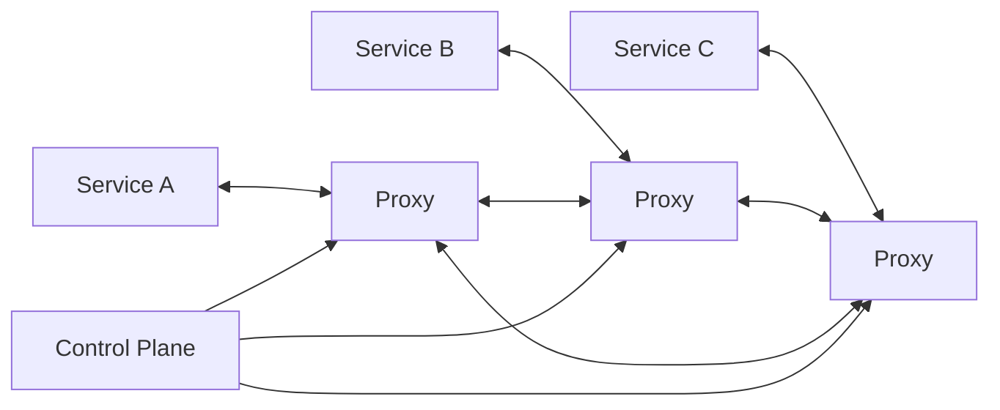
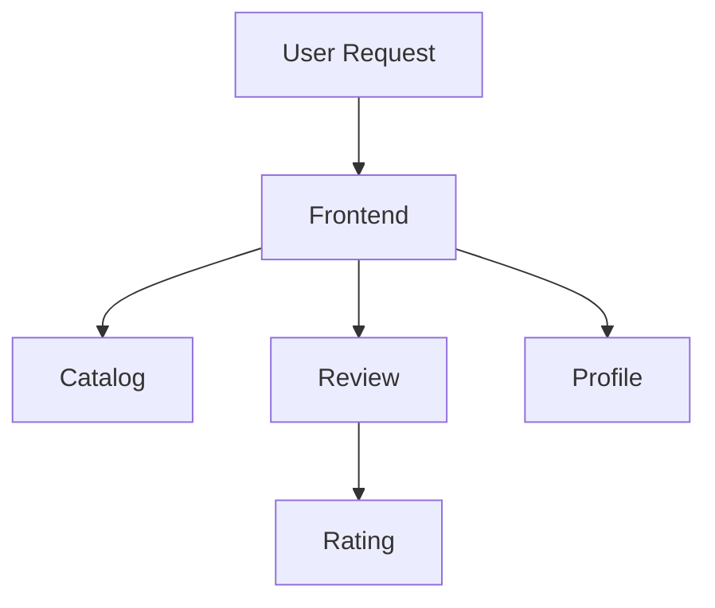
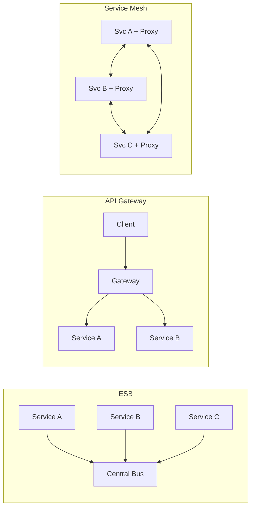
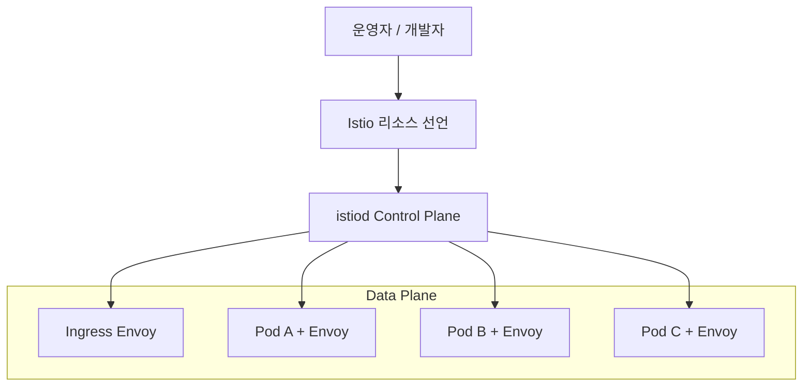
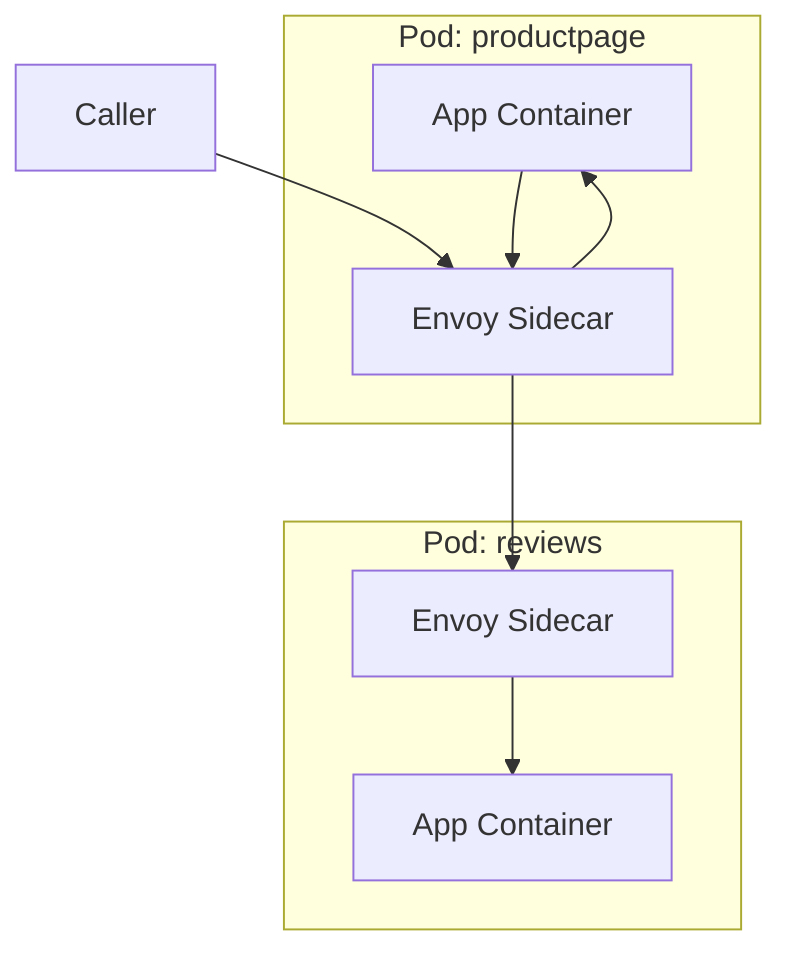
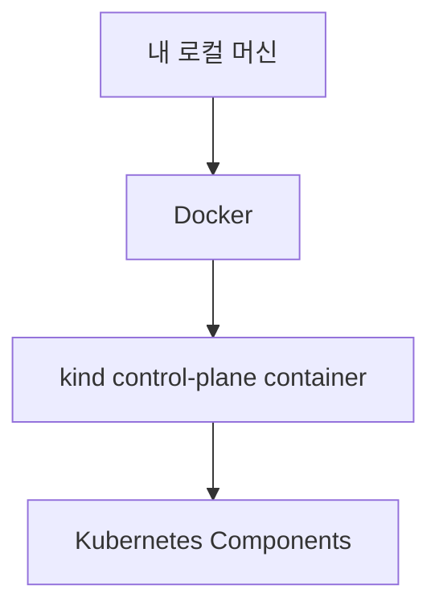
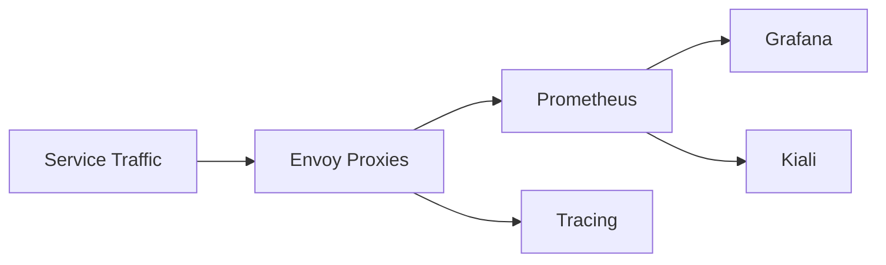
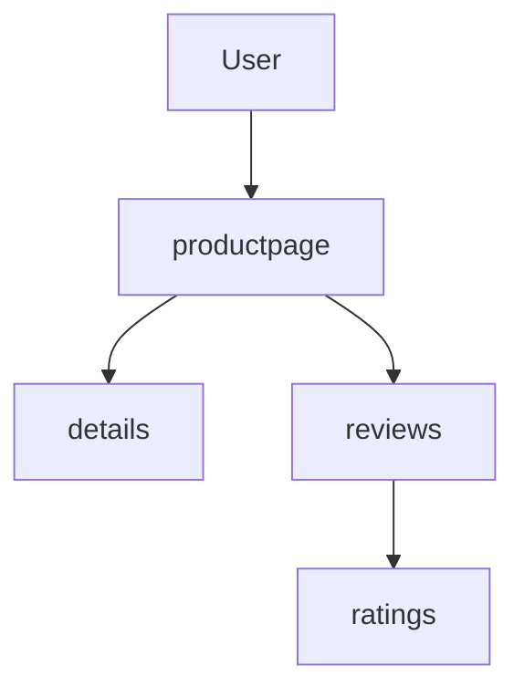
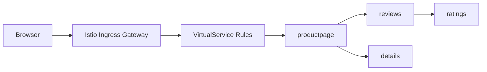
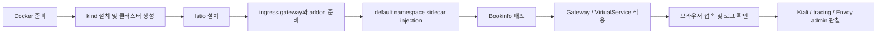

# Week 1. Service Mesh와 Istio 첫 실습 정리

이 문서는 2025년 4월 10일에 게시된 KimDoKy의 `ServiceMesh - Istio - Week1` 글을 바탕으로,  
현재 이 저장소의 1주차 복습 문서 형식에 맞게 다시 정리한 내용이다.

목표는 두 가지다.

- 블로그 원문의 전체 흐름을 빠짐없이 따라간다
- 이후 실습 때 바로 다시 볼 수 있도록 개념, 구조, 명령, 관찰 포인트를 한 문서에 묶는다

원문은 서비스 메시 소개와 Istio 첫 실습을 함께 다룬다.  
이 문서도 같은 순서를 유지한다.

- 1부: 왜 서비스 메시가 필요한가
- 2부: Istio는 어떤 구조로 이를 해결하는가
- 3부: kind 기반 실습 환경에서 무엇을 설치하고 무엇을 확인하는가
- 4부: Bookinfo를 통해 메시의 동작을 어떻게 눈으로 확인하는가

## 1. 이 문서의 기준

원문 블로그는 2025년 4월 10일 게시물이며, 실습 예시는 2025년 4월 초 시점의 버전과 명령을 포함한다.  
따라서 이 저장소 문서에서는 다음 기준을 분리해 적는다.

- 개념 설명: 원문 흐름을 최대한 그대로 따른다
- 실습 맥락: 원문에 나온 명령과 관찰 포인트를 유지한다
- 저장소 로컬 파일: 현재 repo에 있는 [`week1/practice`](../week1/practice/) 내용을 함께 참조한다
- 최신성 주의: 버전 번호나 설치 명령은 실행 전에 공식 문서로 다시 확인한다

## 2. 서비스 메시 소개하기

### 2.1 서비스 메시란

서비스 메시는 분산 애플리케이션을 위한 네트워크 인프라 계층이다.  
애플리케이션 사이의 통신을 안전하고, 복원력 있게, 관찰 가능하도록 만든다.

핵심은 네트워크 문제를 애플리케이션 코드 내부가 아니라 외부 계층으로 분리하는 데 있다.

- 통신 보안
- 트래픽 제어
- 재시도와 타임아웃
- 메트릭과 트레이싱
- 정책 적용

이 기능들을 특정 언어나 프레임워크에 의존하지 않고 공통 계층에서 처리한다.



### 2.2 서비스 메시가 필요한 이유

원문은 클라우드 네이티브 환경에서 다음 세 가지 문제가 반복된다고 정리한다.

- 불규칙한 요청 처리 시간
- 배포 자동화의 위험성
- 보안의 일관성 부족

마이크로서비스에서는 요청 하나가 여러 서비스 호출로 쪼개진다.  
그 결과 비즈니스 로직만큼이나 서비스 간 통신 품질이 중요해진다.



이 구조에서는 다음과 같은 문제가 자연스럽게 발생한다.

- 한 서비스의 지연이 상위 서비스의 전체 응답 시간을 망친다
- 재시도 정책이 잘못되면 장애를 완화하지 못하고 오히려 증폭한다
- 팀마다 다른 보안 방식을 쓰면 전체 시스템 기준이 무너진다
- 어디서 병목이 생겼는지 추적하기 어렵다

서비스 메시의 가치는 여기서 나온다.  
복원력, 보안, 메트릭 수집 같은 공통 기능을 애플리케이션 밖으로 빼내 운영을 단순화한다.

### 2.3 Istio는 무엇인가

Istio는 서비스 메시의 대표적인 오픈소스 구현체다.  
애플리케이션 코드를 직접 수정하지 않고도 네트워크 계층에 다음 기능을 붙일 수 있다.

- 복원력
- 관찰 가능성
- 트래픽 제어
- 보안

또한 Kubernetes뿐 아니라 VM 등 다양한 실행 환경까지 고려한 구조를 가진다.

## 3. 서비스 메시의 주요 기능

원문은 서비스 메시의 기능을 네 가지 축으로 정리한다.

### 3.1 복원력

- 재시도
- 타임아웃
- 서킷 브레이커

장애를 완전히 없애는 것이 아니라, 장애가 전파되는 방식을 통제한다.

### 3.2 관찰 가능성

- 메트릭 수집
- 분산 추적
- 서비스 간 호출 가시화

문제는 "장애가 났다"가 아니라 "어디서 어떻게 났는가"를 알아야 풀린다.  
서비스 메시는 이 관찰 지점을 프록시 계층에 공통으로 둔다.

### 3.3 트래픽 제어

- 카나리 릴리즈
- 단계적 롤아웃
- 버전별 라우팅
- 헤더 기반 라우팅

즉, 배포와 라우팅을 애플리케이션 내부 분기문이 아니라 선언적 정책으로 다룰 수 있다.

### 3.4 보안

- mTLS
- 정책 강제
- 접근 제어

서비스 간 통신을 "되는지" 수준이 아니라 "누가 누구에게 어떤 조건으로 접근 가능한지" 수준으로 제어할 수 있다.

## 4. 서비스 메시와 다른 기술 비교

원문은 ESB, API Gateway, Service Mesh를 비교한다.  
이 비교를 이해해야 메시가 무엇을 해결하고 무엇은 해결하지 않는지 구분된다.

### 4.1 ESB

- 중앙집중식 구조
- 병목 가능성 존재
- 비즈니스 로직과 네트워크 책임이 섞이기 쉽다

### 4.2 API Gateway

- 주로 외부 공개 API 진입점 관리에 초점
- 인증, 라우팅, 외부 노출에 강점
- 내부 서비스 간 트래픽 전반을 다루는 데는 한계가 있다

### 4.3 Service Mesh

- 분산형 구조
- 내부 서비스 간 통신 관리에 최적화
- 복원력, 보안, 관찰 가능성에 집중



정리하면 다음과 같다.

- ESB는 중앙 허브 성격이 강하다
- API Gateway는 남에게 공개하는 경계 관리에 강하다
- Service Mesh는 내부 서비스 간 통신 운영에 강하다

## 5. 서비스 메시 도입 시 고려사항

원문은 장점만 나열하지 않고 도입 비용도 분명히 짚는다.

### 5.1 복잡성 증가

- 요청 경로에 프록시 계층이 추가된다
- 디버깅 포인트가 늘어난다
- 프록시에 익숙하지 않으면 블랙박스로 느껴질 수 있다

### 5.2 테넌시와 정책 관리

- 적절한 격리 모델이 필요하다
- 정책 없이 여러 팀이 공유하면 충돌 가능성이 커진다

### 5.3 운영 부담

- 새 계층을 도입하는 만큼 조직의 운영 절차도 바뀌어야 한다
- 설치만 끝난다고 운영이 끝나는 구조가 아니다

즉, 서비스 메시도 명확한 트레이드오프가 있다.  
도입 전에는 기술 적합성과 조직 준비 상태를 함께 봐야 한다.

## 6. Istio의 큰 구조

원문은 Istio를 `Data Plane`과 `Control Plane`으로 나눠 설명한다.  
이 구분은 1주차에서 가장 중요하다.

### 6.1 Data Plane

Data Plane은 실제 트래픽이 지나가는 계층이다.  
Istio에서는 주로 Envoy 프록시가 이 역할을 맡는다.

Envoy는 다음 기능을 실행한다.

- 요청 전달
- 라우팅
- 재시도와 타임아웃
- 보안 정책 집행
- 메트릭과 트레이스 생성

### 6.2 Control Plane

Control Plane은 Data Plane의 동작을 제어하는 계층이다.  
Istio에서는 핵심 컴포넌트가 `istiod`다.

`istiod`는 다음 역할을 맡는다.

- 서비스 디스커버리
- 설정 배포
- 정책 관리
- 보안 관련 제어

### 6.3 구조 한눈에 보기



핵심 문장으로 줄이면 이렇다.

- 정책은 Control Plane이 만든다
- 트래픽은 Data Plane이 처리한다

## 7. Envoy와 Istiod

### 7.1 Envoy

Envoy는 단순한 네트워크 포워더가 아니다.  
Istio에서 선언한 정책을 실제 요청 경로에서 집행하는 런타임이다.

예를 들어 이런 동작은 Envoy가 수행한다.

- 특정 버전으로 일부 트래픽 전달
- 실패 시 재시도
- 타임아웃 초과 시 요청 종료
- mTLS 적용
- 액세스 로그와 메트릭 생성

### 7.2 Istiod

`istiod`는 메시의 제어면 두뇌다.

- 클러스터와 Istio 리소스를 읽고
- 서비스 관계를 해석하고
- 각 프록시에 필요한 구성을 생성하고
- 그 구성을 Envoy에 전달한다

### 7.3 두 컴포넌트의 관계


이 구분을 이해하면 장애 분석도 쉬워진다.

- 선언이 잘못된 것인지
- 선언은 맞는데 프록시에 반영이 안 된 것인지
- 반영은 됐는데 실제 요청이 예상과 다르게 흐르는 것인지

## 8. Sidecar 패턴

Istio의 전통적인 데이터 플레인 모델은 `Sidecar`다.  
애플리케이션 컨테이너 옆에 Envoy 프록시를 함께 넣는다.



### 8.1 장점

- 애플리케이션 코드 수정 최소화
- 언어와 프레임워크에 독립적인 공통 기능 제공
- 인바운드, 아웃바운드 트래픽 모두 관찰 가능

### 8.2 비용

- 파드마다 프록시가 추가된다
- 리소스 사용량이 늘어난다
- 운영 복잡도가 올라간다

따라서 sidecar는 편리한 마법이 아니라, 명확한 비용을 수반하는 구조다.

## 9. Istio 첫 걸음

원문 후반부는 개념 설명을 넘어 실제 실습으로 들어간다.  
핵심은 "kind로 클러스터를 만들고, Istio를 올리고, Bookinfo를 통해 메시가 보이는 상태까지 가보는 것"이다.

## 10. 실습 환경 준비

### 10.1 Docker Desktop

원문 기준 권장 자원은 대략 다음과 같다.

- vCPU 4 이상
- Memory 8GB 이상

실습은 kind 기반이므로 Docker가 정상 동작해야 한다.

### 10.2 기본 도구

원문에서 필수 도구로 제시한 항목은 다음과 같다.

- `kind`
- `kubectl`
- `helm`

유틸리티 도구는 다음이 소개된다.

- `krew`
- `kube-ps1`
- `kubectx`
- `kubecolor`
- `neat`
- `stern`

원문 예시 명령:

```bash
brew install kind
kind --version

brew install kubernetes-cli
kubectl version --client=true

brew install helm
helm version

brew install krew
brew install kube-ps1
brew install kubectx
brew install kubecolor
kubectl krew install neat stern
```

### 10.3 kind 기본 확인

원문은 kind를 단순히 생성하는 데서 끝내지 않고, 클러스터 내부가 어떻게 구성됐는지 직접 확인하게 한다.

```bash
kind create cluster
kind get clusters
kind get nodes
kubectl cluster-info
kubectl get node -o wide
kubectl get pod -A
kubectl get componentstatuses
```

여기서 확인하려는 포인트는 다음과 같다.

- kind 클러스터가 실제로 도커 컨테이너 위에서 동작한다
- K8s API 서버가 로컬 포트로 노출된다
- 노드 런타임과 네트워크 정보가 보인다

## 11. kind로 Kubernetes 배포

원문은 단일 노드 kind 클러스터를 직접 생성하면서 포트 매핑과 네트워크를 확인한다.

### 11.1 원문 예시 포인트

- 클러스터 이름: `myk8s`
- 노드 이미지: `kindest/node:v1.32.2`
- 포트 매핑: `30000`~`30003`
- kind 네트워크 생성 확인
- Docker 컨테이너 관점에서 control-plane 노드 확인



### 11.2 왜 이 확인이 중요한가

1주차에서는 "쿠버네티스가 추상적으로 있다"가 아니라 실제 런타임이 무엇인지 보는 편이 좋다.

- control-plane 노드는 사실상 도커 컨테이너다
- 로컬 접속 포트가 API 서버로 전달된다
- kind는 별도 도커 네트워크를 만든다

이걸 알고 나면 이후 NodePort나 ingress 테스트가 훨씬 덜 막힌다.

### 11.3 저장소 로컬 파일

현재 저장소에는 최소 구성의 kind 설정 파일이 있다.

- [`week1/practice/kind-config.yaml`](../week1/practice/kind-config.yaml)

원문처럼 포트 매핑이 많은 실습형 설정은 문서 설명용이고, 로컬 파일은 더 단순하게 유지되어 있을 수 있다.  
실제로 어떤 형태를 쓸지는 실습 목적에 따라 결정하면 된다.

## 12. Istio 설치

원문은 Istio 설치를 "첫 애플리케이션을 올리기 위한 기반"으로 설명한다.  
여기서 중요한 것은 `istiod`와 `istio-ingressgateway`가 올라오는 구조를 직접 보는 것이다.

### 12.1 원문 기준 설치 흐름

- Istio 다운로드
- `demo` 프로파일 설치
- ingress gateway 활성화
- egress gateway 비활성화

원문 예시는 대략 이런 구조다.

```bash
export ISTIOV=1.25.1
curl -s -L https://istio.io/downloadIstio | ISTIO_VERSION=$ISTIOV sh -
cd istio-$ISTIOV

cat <<'EOF' | istioctl install -y -f -
apiVersion: install.istio.io/v1alpha1
kind: IstioOperator
spec:
  profile: demo
  components:
    ingressGateways:
    - name: istio-ingressgateway
      enabled: true
    egressGateways:
    - name: istio-egressgateway
      enabled: false
EOF
```

### 12.2 저장소 로컬 설치 스크립트

현재 저장소에는 좀 더 단순화된 설치 스크립트가 있다.

- [`week1/practice/install-istio-demo.sh`](../week1/practice/install-istio-demo.sh)

이 스크립트는 기본값으로 `ISTIO_VERSION=1.29.0`을 사용한다.  
즉, 블로그 원문은 당시 시점 기준 예시이고, 저장소 실습 파일은 더 최근 기준으로 관리되고 있다.

### 12.3 설치 후 확인 포인트

```bash
kubectl get all -n istio-system
kubectl get crd | grep istio.io | sort
```

여기서 봐야 하는 것은 다음이다.

- `istiod`가 떠 있는가
- `istio-ingressgateway`가 떠 있는가
- Istio CRD가 설치됐는가

## 13. Ingress Gateway와 addon 준비

원문은 실습 편의를 위해 `istio-ingressgateway`와 addon 서비스들을 NodePort로 바꾸는 흐름을 보여준다.

### 13.1 ingress gateway NodePort

대표 예시:

```bash
kubectl patch svc -n istio-system istio-ingressgateway \
  -p '{"spec":{"type":"NodePort","ports":[{"port":80,"targetPort":8080,"nodePort":30000}]}}'
```

또한 `externalTrafficPolicy: Local` 설정도 예시로 등장한다.  
이 부분은 Client IP 관찰 같은 특정 실습 목적이 있을 때 사용된다.

### 13.2 기본 namespace sidecar 주입

```bash
kubectl label namespace default istio-injection=enabled
kubectl get ns --show-labels
```

이 라벨이 있어야 이후 배포되는 앱 파드에 `istio-proxy` 사이드카가 자동 주입된다.

### 13.3 addon 설치

원문은 다음 addon을 함께 띄운다.

- Prometheus
- Grafana
- Kiali
- tracing

```bash
kubectl apply -f samples/addons
kubectl rollout status deployment/kiali -n istio-system
kubectl get pod,svc -n istio-system
```

### 13.4 addon의 의미

- Prometheus: envoy와 istio 메트릭 확인
- Grafana: 시각화 대시보드
- Kiali: 서비스 메시 토폴로지 시각화
- tracing: 요청 흐름 확인



1주차에서 이 addon들은 "예쁘게 보이기 위한 보너스"가 아니라,  
서비스 메시가 정말 트래픽을 감싸고 있다는 증거를 보여주는 도구다.

## 14. Bookinfo 샘플 애플리케이션

Bookinfo는 Istio 입문 실습의 표준 예제다.  
원문도 이 앱을 통해 메시의 기본 동작을 설명한다.

구성 서비스는 다음과 같다.

- `productpage`
- `details`
- `reviews`
- `ratings`



### 14.1 왜 Bookinfo를 쓰는가

- 호출 관계가 단순하고 명확하다
- UI로 결과를 바로 확인할 수 있다
- 버전 라우팅 실험이 쉽다
- 이후 observability, resiliency, traffic routing 실습으로 자연스럽게 이어진다

### 14.2 배포

원문 기준 예시는 다음과 같다.

```bash
kubectl apply -f samples/bookinfo/platform/kube/bookinfo.yaml
kubectl get all,sa
```

현재 저장소에도 대응 파일이 들어 있다.

- [`week1/practice/bookinfo.yaml`](../week1/practice/bookinfo.yaml)

### 14.3 확인 포인트

- 각 서비스와 파드가 정상 생성됐는가
- 파드에 `istio-proxy` 컨테이너가 붙었는가
- 서비스 어카운트가 생성됐는가

특히 1주차에서는 `istio-proxy` 존재 여부를 직접 보는 것이 중요하다.

```bash
kubectl get pods
kubectl describe pod <pod-name>
kubectl logs -l app=productpage -c istio-proxy --tail=-1
```

## 15. 외부 트래픽 열기

Bookinfo를 띄웠다고 바로 브라우저에서 보이는 것은 아니다.  
원문은 Gateway와 VirtualService를 적용해 외부 요청을 `productpage`로 보내는 흐름을 설명한다.

### 15.1 Gateway와 VirtualService

현재 저장소에도 동일 계열의 파일이 있다.

- [`week1/practice/bookinfo-gateway.yaml`](../week1/practice/bookinfo-gateway.yaml)

핵심 개념은 다음과 같다.

- `Gateway`: 어떤 포트와 호스트로 외부 요청을 받을지 정의
- `VirtualService`: 받은 요청을 어떤 내부 서비스로 보낼지 정의



### 15.2 적용과 확인

```bash
kubectl apply -f samples/bookinfo/networking/bookinfo-gateway.yaml
kubectl get gw,vs
istioctl proxy-status
```

그리고 브라우저 또는 curl로 확인한다.

```bash
open http://127.0.0.1:30000/productpage
curl -v -s http://127.0.0.1:30000/productpage | grep -o "<title>.*</title>"
```

### 15.3 왜 새로고침할 때 화면이 달라지는가

원문은 reviews 서비스의 서로 다른 버전으로 트래픽이 가는 모습을 캡처로 보여준다.  
즉, 같은 `productpage`라도 내부적으로 다른 버전의 백엔드가 응답할 수 있다.

이 현상이 중요한 이유:

- Istio는 단순 프록시가 아니라 라우팅 정책 집행기다
- 사용자는 같은 URL을 보지만 내부 트래픽은 다른 버전으로 갈 수 있다
- 이후 카나리, 헤더 기반 라우팅, 버전 고정 개념으로 이어진다

## 16. 관측과 디버깅 포인트

원문은 단순 접속 확인에서 멈추지 않고, 프록시 로그와 시각화 도구를 함께 보게 만든다.

### 16.1 Access Log

```bash
kubectl logs -l app=productpage -c istio-proxy -f
kubectl stern -l app=productpage
```

이 로그는 실제 요청이 프록시를 통과했다는 가장 직접적인 증거다.

### 16.2 Kiali 시각화

원문 캡처의 핵심 메시지는 이것이다.

- 요청 흐름이 서비스 그래프로 보인다
- 메시 내부 연결 관계를 한눈에 파악할 수 있다

즉, "서비스들이 대충 통신한다"가 아니라 "어느 요청이 어디를 지나는지"가 시각화된다.

### 16.3 ingress gateway 로그 레벨 조정

원문은 ingress gateway 프록시의 로그 레벨도 실험해본다.

```bash
kubectl exec -it deploy/istio-ingressgateway -n istio-system -- \
  curl -X POST http://localhost:15000/logging

kubectl exec -it deploy/istio-ingressgateway -n istio-system -- \
  curl -X POST http://localhost:15000/logging?http=debug

kubectl exec -it deploy/istio-ingressgateway -n istio-system -- \
  curl -X POST http://localhost:15000/logging?http=info
```

이 단계는 "프록시도 관리 대상"이라는 사실을 보여준다.

### 16.4 Envoy admin 페이지

```bash
kubectl port-forward deployment/deploy-websrv 15000:15000 &
open http://localhost:15000
```

원문은 Envoy admin 페이지까지 열어보며 프록시 내부 상태를 직접 확인한다.  
1주차에서 여기까지 볼 수 있으면 Data Plane 이해가 훨씬 빨라진다.

## 17. 1주차에서 반드시 남겨야 할 이해

이 주차의 핵심은 기능을 많이 쓰는 것이 아니라 구조를 올바르게 이해하는 것이다.

### 17.1 설명할 수 있어야 하는 질문

- 왜 마이크로서비스에서 네트워크가 운영 문제가 되는가
- 서비스 메시는 어떤 책임을 애플리케이션 밖으로 빼내는가
- Istio의 Control Plane과 Data Plane은 무엇이 다른가
- Envoy는 무엇을 실행하고, `istiod`는 무엇을 제어하는가
- Sidecar는 왜 강력하지만 동시에 비용이 드는가
- Bookinfo는 왜 입문 실습의 표준 예제인가

### 17.2 설치 후 직접 확인해야 하는 것

- `istiod`와 `istio-ingressgateway`가 정상 기동하는가
- namespace에 sidecar injection 라벨이 붙었는가
- Bookinfo 파드에 `istio-proxy`가 실제로 주입됐는가
- Gateway와 VirtualService가 생성됐는가
- 브라우저 요청이 ingress를 거쳐 내부 서비스로 들어가는가
- Kiali나 로그에서 요청 흐름이 보이는가

## 18. 원문 기반 실습 순서 요약



이 순서는 그냥 설치 순서가 아니다.  
메시가 어떻게 쌓이는지를 그대로 보여주는 순서다.

## 19. 도전 과제

원문 마지막에는 추가 학습용 과제가 제시된다.

### 19.1 Sail Operator

Istio 운영과 업그레이드를 더 편하게 다루는 방법으로 Sail Operator를 탐색해보는 과제다.

### 19.2 Gateway API 기반 ingress 구성

기존 Istio Gateway 대신 Kubernetes Gateway API를 사용해 실습 환경을 구성해보는 과제다.

### 19.3 Kubernetes Native Sidecars

Istio Proxy를 K8s 네이티브 사이드카 관점에서 살펴보는 과제다.

이 과제들은 1주차 필수 범위는 아니지만,  
Istio 생태계가 현재 어디로 이동하는지 보는 데 의미가 있다.

## 20. 저장소 기준 실습 파일

현재 저장소에서 바로 참고할 파일:

- [`week1/practice/install-istio-demo.sh`](../week1/practice/install-istio-demo.sh)
- [`week1/practice/kind-config.yaml`](../week1/practice/kind-config.yaml)
- [`week1/practice/bookinfo.yaml`](../week1/practice/bookinfo.yaml)
- [`week1/practice/bookinfo-gateway.yaml`](../week1/practice/bookinfo-gateway.yaml)
- [`week1/practice/destination-rule-all.yaml`](../week1/practice/destination-rule-all.yaml)

이 파일들은 블로그 원문을 그대로 복제한 것이 아니라,  
현재 repo에서 재사용하기 좋은 형태로 정리된 실습 자산이다.

## 21. 1주차 체크리스트

- [ ] 서비스 메시의 필요성을 설명할 수 있다
- [ ] ESB, API Gateway, Service Mesh의 차이를 구분할 수 있다
- [ ] Istio의 Control Plane과 Data Plane을 설명할 수 있다
- [ ] Envoy와 `istiod`의 역할을 구분할 수 있다
- [ ] Sidecar 패턴의 장점과 비용을 설명할 수 있다
- [ ] kind 클러스터가 도커 컨테이너 기반이라는 점을 이해했다
- [ ] `istio-system`의 핵심 컴포넌트를 확인했다
- [ ] `istio-injection=enabled` 라벨의 의미를 이해했다
- [ ] Bookinfo 서비스 관계를 설명할 수 있다
- [ ] Gateway와 VirtualService가 외부 요청을 내부 서비스로 연결하는 흐름을 설명할 수 있다
- [ ] 로그, Kiali, tracing이 왜 필요한지 설명할 수 있다

## 22. 참고 링크

- [1주차 참고 링크 모음](../references/week1-links.md)
- 원문 블로그: https://kimdoky.github.io/devops/2025/04/10/study-istio-week1/

## 23. 한 줄 요약

1주차의 본질은 "Istio 명령을 많이 외우는 것"이 아니다.  
서비스 메시가 왜 필요한지, Istio가 어떤 구조로 그것을 구현하는지, 그리고 Bookinfo를 통해 그 구조가 실제 트래픽 위에서 어떻게 드러나는지를 처음으로 눈에 익히는 주차다.
