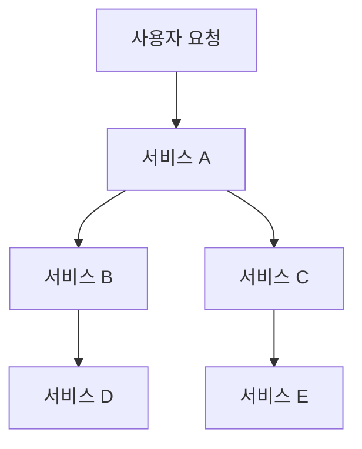
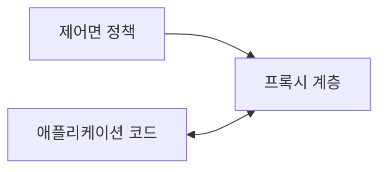
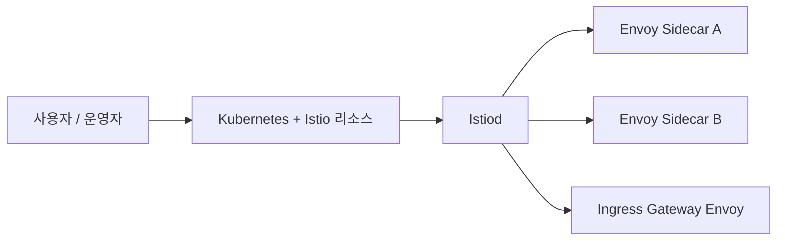
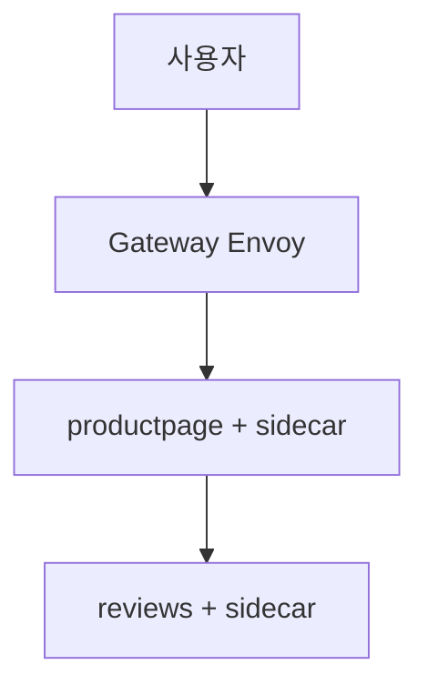
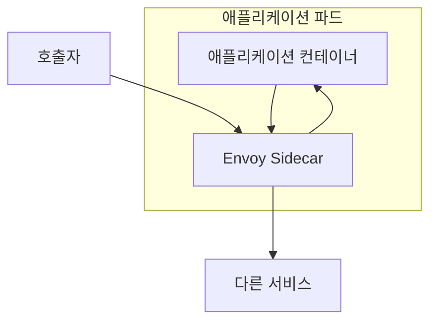
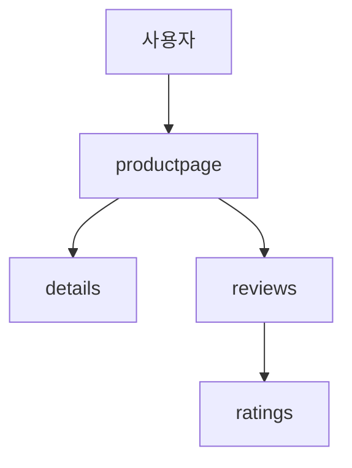
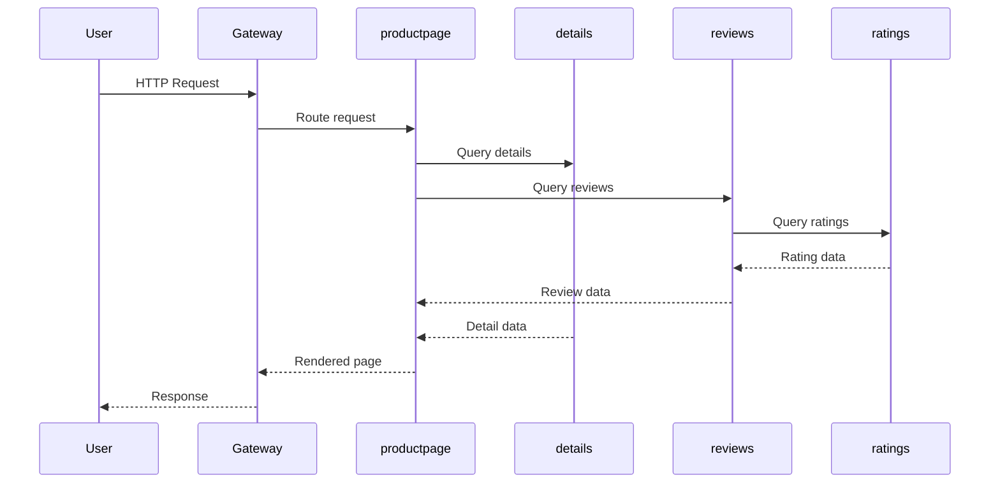

# Week 1. Istio 개요와 첫 설치

이 문서는 Istio 1주차 복습을 위한 정리다.  
주요 목적은 다음 내용을 정확하게 정리하는 것이다.

- 왜 Service Mesh가 필요한가
- Istio는 어떤 구조로 동작하는가
- Envoy와 Istiod는 각각 어떤 역할을 가지는가
- Sidecar 모델은 무엇을 가능하게 하는가
- Bookinfo는 왜 첫 실습 예제로 사용되는가
- 1주차에서 어떤 명령으로 환경을 구성하고 무엇을 확인해야 하는가

이 정리는 공개 커뮤니티 자료와 Istio 공식 문서를 함께 참고해 다시 구성했다.  
설명은 커뮤니티 글의 공통분모를 기반으로 정리했고, 설치 흐름과 버전 의존 내용은 공식 문서 기준으로 보수적으로 맞췄다.

## 1. 문제 배경

마이크로서비스 아키텍처에서는 하나의 사용자 요청이 여러 서비스 호출로 분해된다.  
이 구조에서는 비즈니스 로직만 나뉘는 것이 아니라, 서비스 간 통신 자체가 중요한 운영 대상이 된다.

대표적인 문제는 다음과 같다.

- 서비스마다 타임아웃과 재시도 정책이 다르다
- 배포 시 일부 트래픽만 새 버전으로 전환하기 어렵다
- 서비스 간 통신 보안을 일관되게 적용하기 어렵다
- 장애가 발생했을 때 어느 호출 구간에서 실패했는지 추적하기 어렵다
- 공통 메트릭과 로그 형식을 유지하기 어렵다



서비스 수가 적을 때는 이 문제를 코드 수준에서 직접 다뤄도 버틸 수 있다.  
그러나 서비스가 늘어날수록 공통 네트워크 기능은 서비스 코드 안에 흩어지고, 운영 규칙은 일관성을 잃는다.

### 1.1 왜 네트워크가 별도 운영 문제로 바뀌는가

모놀리식 애플리케이션에서는 내부 호출이 많기 때문에 네트워크는 외부 입출력 경계 정도로 남는다.  
반면 마이크로서비스에서는 호출 하나하나가 모두 네트워크 이벤트가 된다.

이 차이 때문에 다음 같은 현상이 생긴다.

- 느린 하위 서비스 하나가 상위 서비스의 전체 응답 시간을 악화시킨다
- 재시도 정책이 잘못되면 장애를 복구하는 대신 확대할 수 있다
- 보안 통신을 서비스별로 구현하면 팀마다 수준이 달라진다
- 관측성 정보가 제각각이면 장애 시 근본 원인 분석이 어렵다

즉, 마이크로서비스 환경에서는 기능 분해보다 `통신 통제`가 더 어려운 문제가 된다.

### 1.2 서비스 코드에 직접 넣을 때의 한계

서비스별로 직접 구현하기 시작하면 아래와 같은 상태가 된다.

- 주문 서비스는 타임아웃 1초
- 결제 서비스는 타임아웃 5초
- 재고 서비스는 3회 재시도
- 추천 서비스는 실패 시 즉시 포기
- 일부 서비스는 TLS, 일부는 평문 통신
- 메트릭 이름과 레이블 체계도 제각각

결국 운영팀 입장에서는 "서비스 코드가 다르다"보다 `운영 규칙이 코드 안에 흩어진다`는 점이 더 큰 문제다.

## 2. Service Mesh

Service Mesh는 서비스 간 통신에서 반복되는 공통 기능을 애플리케이션 밖으로 분리한다.

대표적으로 분리 대상이 되는 기능은 다음과 같다.

- 로드 밸런싱
- 재시도
- 타임아웃
- 회로 차단
- 트래픽 분할
- TLS 암호화
- 서비스 간 인증
- 접근 제어
- 메트릭 수집
- 분산 추적

핵심은 기능 제거가 아니라 책임 위치의 이동이다.  
애플리케이션은 여전히 도메인 로직을 수행한다.  
반면 통신 정책, 보안, 복원력, 관측성은 메시 계층이 담당한다.



### 2.1 Service Mesh를 이렇게 이해하는 편이 정확하다

1. 애플리케이션은 비즈니스 로직을 수행한다
2. 프록시는 서비스 간 통신을 중개한다
3. 제어면은 프록시에 적용할 정책을 생성하고 배포한다

### 2.2 Istio가 해결하려는 문제의 범위

Istio는 애플리케이션 프레임워크를 대체하지 않는다.  
또한 서비스 간 통신 자체를 없애지도 않는다.  
대신 통신을 더 관찰 가능하고, 더 제어 가능하며, 더 일관되게 만든다.

## 3. Istio 구조

Istio는 크게 `control plane`과 `data plane`으로 나뉜다.

### 3.1 Control Plane

Control plane의 핵심 컴포넌트는 `Istiod`다.

Istiod는 다음 역할을 담당한다.

- Kubernetes와 Istio 리소스를 읽는다
- 서비스 디스커버리 정보를 수집한다
- 프록시에 필요한 구성을 생성한다
- 그 구성을 각 Envoy에 전달한다

즉, 사람이 선언한 정책을 프록시가 실행 가능한 구성으로 바꾸는 제어면이다.

### 3.2 Data Plane

Data plane의 핵심은 `Envoy` 프록시다.

Envoy는 다음 역할을 담당한다.

- 서비스 간 요청 전달
- 라우팅 정책 집행
- 재시도, 타임아웃, 회로 차단 적용
- TLS와 인증 정책 실행
- 메트릭과 트레이스 데이터 생성

즉, Istio 리소스는 선언이고, Envoy는 실행이다.

### 3.3 구조 요약



이 구조를 요약하면 다음과 같다.

> 사용자는 정책을 선언하고, Istiod는 그 선언을 해석하며, Envoy는 실제 요청에 그 정책을 적용한다.

### 3.4 요청 처리 관점에서 본 구조

제어 흐름과 요청 흐름은 다르다.



이 도식이 보여주는 핵심은 아래와 같다.

- 정책은 Istiod에서 만든다
- 실제 요청은 Envoy들이 처리한다
- 따라서 설정 문제와 요청 처리 문제는 같은 층위의 문제가 아니다

## 4. Envoy

Envoy는 단순 프록시가 아니다.  
Istio에서는 네트워크 정책을 실제로 집행하는 실행 계층이다.

예를 들어 다음 정책은 모두 Envoy가 실제 요청에 적용한다.

- 특정 버전으로 10% 트래픽 전송
- 5xx 응답 시 재시도
- 지정 시간 초과 시 타임아웃
- mTLS로 서비스 간 통신
- 특정 워크로드 간 호출 허용 또는 차단

### 4.1 Envoy의 위치

- Sidecar로 배치될 수 있다
- Gateway로 배치될 수 있다
- 따라서 내부 서비스 통신과 외부 진입 트래픽 모두를 다룰 수 있다

### 4.2 Envoy를 이해할 때 중요한 점

- Envoy는 정책을 저장하는 문서가 아니라 정책을 집행하는 런타임이다
- 라우팅, 보안, 텔레메트리, 복원력은 모두 Envoy에서 실제로 드러난다
- Istio를 이해한다는 것은 Envoy가 어디서 어떤 정책을 적용하는지 이해하는 것과 가깝다

### 4.3 1주차 관점에서 Envoy가 중요한 이유

2주차에서 Gateway를 배우고, 3주차에서 트래픽 제어를 배우고, 4주차에서 관측성을 볼 때도 결국 다시 Envoy로 돌아온다.  
따라서 1주차에서 Envoy를 "스마트 프록시" 수준이 아니라 `정책 집행기`로 이해하는 것이 중요하다.

## 5. Istiod

Istiod는 메시의 제어면이다.

1주차 기준에서 기억할 내용은 다음과 같다.

- 사용자가 선언한 리소스를 읽는다
- 서비스와 워크로드 관계를 이해한다
- 각 Envoy에 필요한 구성을 만든다
- 프록시에 그 구성을 전달한다

### 5.1 Istiod를 단순 배포기로만 보면 부족한 이유

Istiod는 단순히 파일을 뿌리는 역할만 하지 않는다.  
메시 안의 서비스 관계와 정책을 해석하고, 그것을 데이터 플레인 실행 계층으로 연결하는 핵심 제어 지점이다.

즉, 다음 주제들도 모두 결국 Istiod를 거친다.

- 트래픽 정책
- 보안 정책
- 텔레메트리 정책

### 5.2 Control Plane과 Data Plane을 분리해서 보는 이유

이 구분은 이후 트러블슈팅에 중요하다.

- 정책 선언이 잘못됐는가
- 선언은 맞는데 프록시에 반영되지 않았는가
- 반영은 됐는데 실제 요청이 예상과 다르게 흐르는가

이 세 문제는 서로 다른 층위다.

## 6. Sidecar Injection

Istio의 전통적인 데이터 플레인 모델은 sidecar다.  
애플리케이션 파드 옆에 Envoy 컨테이너를 함께 넣어 서비스 트래픽을 프록시가 다루게 만든다.



### 6.1 Sidecar 모델의 장점

- 애플리케이션 수정 없이 메시 기능 적용 가능
- 워크로드 단위 정책 적용 가능
- 인바운드와 아웃바운드 트래픽 모두 관찰 가능
- 서비스별 언어와 프레임워크 차이를 프록시 계층에서 흡수 가능

### 6.2 Sidecar 모델의 비용

- 파드마다 프록시가 추가된다
- CPU와 메모리 사용량이 증가한다
- 운영 복잡도가 높아진다
- 프록시 버전과 애플리케이션 버전을 함께 고려해야 한다

즉, sidecar는 Istio의 강점이면서 동시에 운영 비용의 시작점이다.

### 6.3 1주차 실습에서 꼭 확인해야 하는 이유

1주차에서는 sidecar를 개념으로만 보면 안 된다.  
실제로 파드에 `istio-proxy` 컨테이너가 붙는지 확인해야 한다.

그걸 직접 보면 다음 사실이 분명해진다.

- Istio는 실제 런타임을 추가한다
- 메시 기능은 이 프록시 계층을 기반으로 동작한다
- 따라서 기능과 비용이 함께 생긴다

## 7. Bookinfo

Bookinfo는 1주차의 대표 실습 애플리케이션이다.  
중요한 이유는 단순한 데모이기 때문이 아니라, 이후 주차에서도 반복해서 쓰이는 실험장이기 때문이다.

구성 요소는 다음과 같다.

- `productpage`
- `details`
- `reviews`
- `ratings`



### 7.1 Bookinfo가 좋은 예제인 이유

- 서비스 호출 관계가 분명하다
- 버전별 라우팅 실험을 붙이기 쉽다
- 화면으로 결과를 바로 확인할 수 있다
- 트래픽 제어, 관측성, 보안 실습에 반복 사용 가능하다

### 7.2 Bookinfo를 볼 때 확인할 개념

- 사용자는 어디로 들어오는가
- `productpage`는 어떤 백엔드를 호출하는가
- `reviews`와 `ratings`의 관계는 무엇인가
- 왜 이후 주차에서도 같은 앱을 쓰는가

### 7.3 요청 흐름



이 흐름을 이해하면 이후 주차에서 트래픽 제어와 장애 주입이 어디에 적용되는지 자연스럽게 보이기 시작한다.

## 8. 1주차 실습

1주차 실습의 범위는 제한하는 것이 좋다.  
목표는 고급 정책을 적용하는 것이 아니라, 메시 구조를 직접 확인하는 것이다.

### 8.1 실습 목표

1. 로컬 클러스터 준비
2. Istio 설치
3. Bookinfo 배포
4. Gateway 적용
5. Sidecar와 기본 요청 흐름 확인

### 8.2 실습 파일

- [`week1/practice/kind-config.yaml`](../week1/practice/kind-config.yaml)
- [`week1/practice/install-istio-demo.sh`](../week1/practice/install-istio-demo.sh)
- [`week1/practice/bookinfo.yaml`](../week1/practice/bookinfo.yaml)
- [`week1/practice/bookinfo-gateway.yaml`](../week1/practice/bookinfo-gateway.yaml)
- [`week1/practice/destination-rule-all.yaml`](../week1/practice/destination-rule-all.yaml)

### 8.3 구축 순서

```bash
cd week1/practice

# 1. kind 클러스터 생성
kind create cluster --name istio-study --config kind-config.yaml

# 2. Istio 설치
./install-istio-demo.sh

# 3. Bookinfo 배포
kubectl apply -f bookinfo.yaml

# 4. Gateway 및 기본 라우팅 구성
kubectl apply -f bookinfo-gateway.yaml
kubectl apply -f destination-rule-all.yaml
```

### 8.4 왜 이 순서로 하는가

- 클러스터가 있어야 control plane을 배포할 수 있다
- control plane이 있어야 메시 정책을 적용할 수 있다
- 애플리케이션을 올린 뒤 sidecar와 서비스 구성을 확인할 수 있다
- 마지막에 gateway를 적용해야 외부에서 요청을 넣어 전체 흐름을 확인할 수 있다

즉, 이 순서는 단순 설치 순서가 아니라 메시 구성 순서다.

### 8.5 검증 명령

#### Istio 시스템 파드

```bash
kubectl get pods -n istio-system
```

#### 애플리케이션 파드와 사이드카

```bash
kubectl get pods
kubectl describe pod <pod-name>
```

#### 서비스와 게이트웨이 리소스

```bash
kubectl get svc
kubectl get gateway,virtualservice
```

#### 요청 경로를 검증할 때 확인할 흐름


### 8.6 실습 결과로 설명할 수 있어야 하는 내용

- control plane이 먼저 올라온다
- 애플리케이션이 배포된다
- sidecar가 붙는다
- gateway가 외부 요청을 내부 서비스로 전달한다
- 내부 서비스 간 호출은 메시 안에서 처리된다

## 9. 1주차 자료 정리

1주차에서 실제로 정리해야 하는 내용은 다음과 같이 묶는 편이 좋다.

### 9.1 문제 정의

- 왜 마이크로서비스에서 통신이 운영 문제가 되는가
- 서비스별 구현이 왜 한계가 있는가

### 9.2 구조 정의

- control plane
- data plane
- Envoy
- Istiod
- sidecar

### 9.3 실습 정의

- 클러스터 준비
- Istio 설치
- Bookinfo 배포
- Gateway 적용
- 요청 흐름 확인

즉, 1주차는 `문제 -> 구조 -> 구축 -> 확인`의 네 축으로 정리하는 것이 가장 깔끔하다.

## 10. 자주 생기는 오해

### Istio는 Ingress 도구다

아니다. Gateway는 일부 기능일 뿐이다.  
Istio의 핵심은 서비스 간 통신 정책을 플랫폼 계층에서 제어하는 것이다.

### Sidecar만 붙이면 자동으로 모든 것이 해결된다

아니다. Sidecar는 기반을 제공할 뿐이다.  
실제 정책은 이후 리소스 구성으로 명시해야 한다.

### 1주차에서 관측성, 보안, 트래픽 제어를 모두 끝내야 한다

그렇지 않다. 1주차에서는 구조와 기본 흐름을 이해하는 것이 우선이다.

### 커뮤니티 블로그의 설치 예제는 그대로 실행하면 된다

그렇지 않다. 개념과 흐름은 매우 유용하지만, 설치 명령과 버전 의존 내용은 공식 문서 기준으로 다시 확인하는 편이 안전하다.

## 11. 1주차 종료 체크리스트

- [ ] Service Mesh의 필요성을 설명할 수 있다
- [ ] Istio의 control plane과 data plane을 구분할 수 있다
- [ ] Envoy와 Istiod의 역할을 설명할 수 있다
- [ ] Sidecar Injection의 의미를 설명할 수 있다
- [ ] Bookinfo 서비스 관계를 설명할 수 있다
- [ ] 1주차 실습의 구축 순서를 설명할 수 있다
- [ ] 설치 후 무엇을 확인해야 하는지 말할 수 있다

## 12. 참고 자료와 검수 기준

참고 링크는 별도 파일에 정리했다.

- [1주차 참고 링크 모음](../references/week1-links.md)

이번 정리의 원칙은 다음과 같다.

- 개념 설명은 여러 공개 블로그의 공통분모를 취한다
- 버전과 설치 순서는 공식 문서를 기준으로 다시 검수한다
- 오래된 커뮤니티 예제는 맥락 자료로 사용하되, 최신 환경의 정답으로 취급하지 않는다

이 문서는 가이드라기보다 `1주차 복습용 개념 정리`다.  
다음 주차를 진행하기 전, 구조와 용어, 구축 흐름을 다시 확인하는 기준 문서로 사용하는 것이 적절하다.
