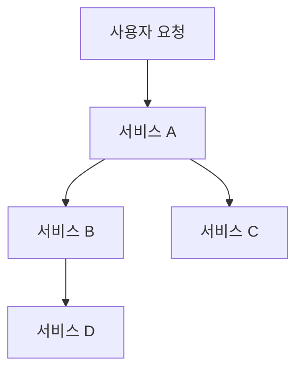
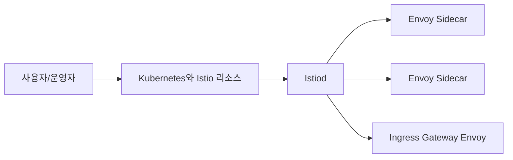
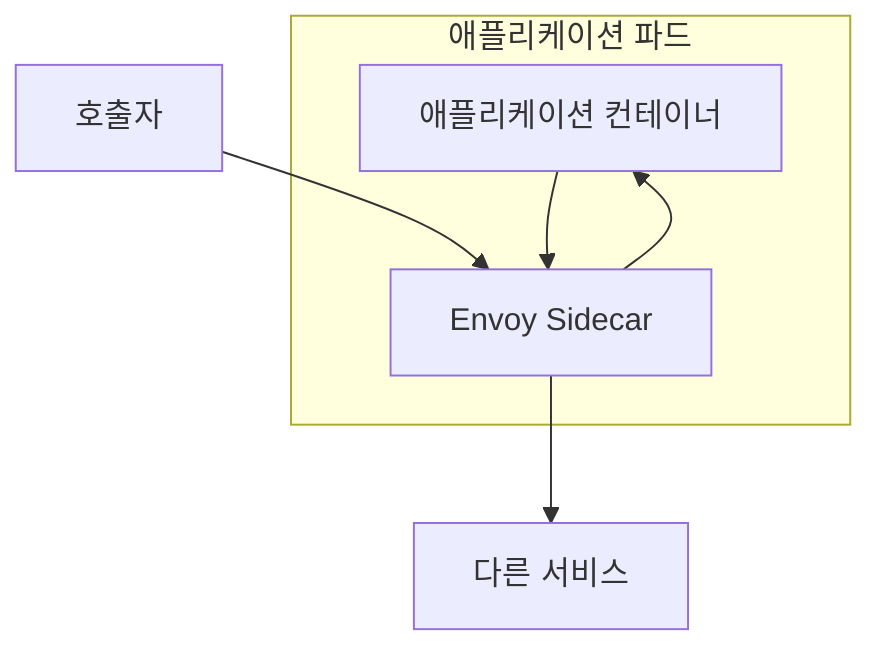
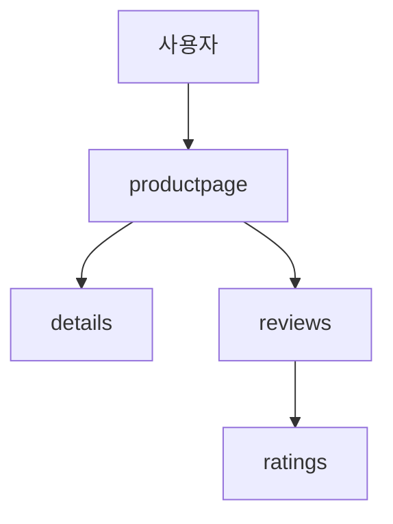

# Week 1. Istio 개요와 첫 설치

이 문서는 Istio 1주차 복습을 위한 정리다.  
목표는 다음 네 가지를 명확히 이해하는 것이다.

- 왜 Service Mesh가 필요한가
- Istio는 어떤 구조로 동작하는가
- Envoy와 Istiod는 각각 어떤 역할을 가지는가
- 첫 설치와 Bookinfo 배포는 어떤 순서로 수행하는가

이 글은 공개 커뮤니티 자료와 Istio 공식 문서를 함께 참고해 다시 정리했다.  
개념 설명은 공통분모를 중심으로 구성했고, 설치와 실행 순서는 공식 문서 기준에 맞춰 보수적으로 적었다.

## 1. 문제: 마이크로서비스 환경에서 무엇이 어려워지는가

마이크로서비스 아키텍처에서는 하나의 사용자 요청이 여러 서비스 호출로 분해된다.  
이 구조에서는 비즈니스 로직만 분리되는 것이 아니라, 서비스 간 통신 자체가 중요한 운영 대상이 된다.

대표적인 문제는 다음과 같다.

- 서비스마다 타임아웃과 재시도 정책이 다르다
- 버전 전환 시 일부 트래픽만 새 버전으로 보내기 어렵다
- 서비스 간 통신 보안을 일관되게 적용하기 어렵다
- 장애가 발생했을 때 어느 호출 구간에서 실패했는지 추적하기 어렵다



서비스 수가 적을 때는 이 문제를 코드 수준에서 직접 다뤄도 버틸 수 있다.  
그러나 서비스가 늘어날수록 공통 네트워크 기능이 서비스 코드 안에 흩어지고, 운영 규칙은 일관성을 잃는다.

Istio는 이 문제를 애플리케이션 코드의 확장이 아니라 별도의 메시 계층으로 해결하려고 한다.

## 2. Service Mesh: 무엇을 분리하는가

Service Mesh는 서비스 간 통신에서 반복되는 공통 기능을 애플리케이션 밖으로 분리한다.

여기서 분리 대상이 되는 기능은 보통 다음과 같다.

- 로드 밸런싱
- 재시도
- 타임아웃
- 회로 차단
- 트래픽 분할
- TLS 암호화
- 서비스 간 인증
- 접근 제어
- 메트릭과 분산 추적

핵심은 기능 제거가 아니라 책임 위치의 이동이다.  
애플리케이션은 여전히 도메인 로직을 처리한다.  
반면 통신 정책과 관측성, 보안, 복원력 같은 공통 기능은 메시 계층이 담당한다.

따라서 Service Mesh는 다음과 같이 이해하는 편이 정확하다.

1. 애플리케이션은 비즈니스 로직을 수행한다
2. 프록시는 서비스 간 통신을 중개한다
3. 제어면은 프록시에 적용할 정책을 생성하고 배포한다

## 3. Istio의 기본 구조

Istio는 크게 `control plane`과 `data plane`으로 나뉜다.

### 3.1 Control Plane

Control plane의 핵심 컴포넌트는 `Istiod`다.

Istiod는 다음 작업을 수행한다.

- Kubernetes와 Istio 리소스를 읽는다
- 서비스 디스커버리 정보를 수집한다
- 각 프록시에 필요한 구성을 생성한다
- 그 구성을 프록시에 전달한다

즉, Istiod는 사람이 선언한 정책을 프록시가 실제로 실행할 수 있는 형태로 바꾸는 제어면이다.

### 3.2 Data Plane

Data plane의 핵심은 `Envoy` 프록시다.

Envoy는 다음 작업을 수행한다.

- 서비스 간 요청을 전달한다
- 라우팅 규칙을 집행한다
- 재시도, 타임아웃, 회로 차단 같은 정책을 적용한다
- TLS와 인증 관련 정책을 실행한다
- 메트릭과 트레이스 데이터를 생성한다

즉, Istio 리소스는 선언이고, Envoy는 실행이다.

### 3.3 구조 요약



이 구조를 한 문장으로 정리하면 다음과 같다.

> 사용자는 정책을 선언하고, Istiod는 그 선언을 해석하며, Envoy는 실제 요청에 그 정책을 적용한다.

## 4. Envoy

Envoy는 단순 프록시가 아니다.  
Istio에서는 네트워크 정책을 실제로 집행하는 실행 계층이다.

예를 들어 아래와 같은 정책은 모두 Envoy가 실제 요청에 적용한다.

- 특정 버전으로 10% 트래픽 전송
- 5xx 응답 시 재시도
- 지정 시간 초과 시 타임아웃
- mTLS로 서비스 간 통신
- 특정 워크로드 간 호출 허용 또는 차단

Envoy를 이해할 때 중요한 점은 다음과 같다.

- Envoy는 sidecar로도 배치된다
- Envoy는 gateway로도 배치된다
- Envoy는 메시 안의 실제 트래픽 흐름을 다룬다

따라서 Istio를 이해한다는 것은 결국 Envoy가 어디에서 어떤 정책을 집행하는지 이해하는 것과 가깝다.

## 5. Istiod

Istiod는 메시의 제어면이다.

1주차 기준에서 기억할 내용은 아래 정도면 충분하다.

- 사용자가 선언한 리소스를 읽는다
- 서비스와 워크로드 관계를 이해한다
- 각 Envoy에 필요한 구성을 만든다
- 프록시에 그 구성을 전달한다

이 역할 때문에 Istiod는 단순한 배포기가 아니다.  
메시 전체의 정책과 상태를 프록시 실행 계층으로 연결하는 핵심 제어 지점이다.

## 6. Sidecar Injection

Istio의 전통적인 데이터 플레인 모델은 sidecar다.  
애플리케이션 파드 옆에 Envoy 컨테이너를 함께 넣어 서비스 트래픽을 프록시가 다루게 만든다.



이 방식의 장점은 다음과 같다.

- 애플리케이션 수정 없이 메시 기능 적용 가능
- 워크로드 단위 정책 적용 가능
- 인바운드와 아웃바운드 트래픽을 모두 관측 가능

반면 비용도 존재한다.

- 파드마다 프록시가 추가된다
- CPU와 메모리 사용량이 증가한다
- 운영 복잡도가 높아진다

따라서 sidecar는 Istio의 강점이면서 동시에 운영 비용의 시작점이다.

## 7. Bookinfo

Bookinfo는 1주차의 대표 실습 애플리케이션이다.  
이 샘플이 중요한 이유는 단순한 데모이기 때문이 아니라, 이후 주차에서도 반복해서 쓰이는 실험장이기 때문이다.

구성 요소는 다음과 같다.

- `productpage`
- `details`
- `reviews`
- `ratings`



Bookinfo가 좋은 예제인 이유는 다음과 같다.

- 서비스 호출 관계가 분명하다
- 버전별 라우팅 실험을 붙이기 쉽다
- 화면으로 결과를 바로 확인할 수 있다
- 트래픽 제어, 관측성, 보안 실습에 재사용할 수 있다

1주차에서는 최소한 다음을 설명할 수 있어야 한다.

- 사용자는 어디로 들어오는가
- `productpage`는 어떤 백엔드를 호출하는가
- 왜 이후 주차에서 같은 앱을 반복 사용하는가

## 8. 1주차 실습

1주차 실습의 범위는 제한하는 것이 좋다.  
목표는 "고급 정책 적용"이 아니라 "메시 구조를 직접 확인하는 것"이다.

### 8.1 실습 목표

1. 로컬 클러스터 준비
2. Istio 설치
3. Bookinfo 배포
4. Gateway 적용
5. Sidecar와 기본 요청 흐름 확인

### 8.2 실습 파일

- [`week1/practice/kind-config.yaml`](../week1/practice/kind-config.yaml)
- [`week1/practice/install-istio-demo.sh`](../week1/practice/install-istio-demo.sh)
- [`week1/practice/bookinfo.yaml`](../week1/practice/bookinfo.yaml)
- [`week1/practice/bookinfo-gateway.yaml`](../week1/practice/bookinfo-gateway.yaml)
- [`week1/practice/destination-rule-all.yaml`](../week1/practice/destination-rule-all.yaml)

### 8.3 구축 순서

```bash
cd week1/practice

# kind 클러스터 생성
kind create cluster --name istio-study --config kind-config.yaml

# Istio 설치
./install-istio-demo.sh

# Bookinfo 배포
kubectl apply -f bookinfo.yaml

# Gateway 및 기본 라우팅 구성
kubectl apply -f bookinfo-gateway.yaml
kubectl apply -f destination-rule-all.yaml
```

### 8.4 실습 중 확인할 항목

#### Istio 시스템 파드

```bash
kubectl get pods -n istio-system
```

#### 애플리케이션 파드와 사이드카

```bash
kubectl get pods
kubectl describe pod <pod-name>
```

#### 서비스와 게이트웨이 리소스

```bash
kubectl get svc
kubectl get gateway,virtualservice
```

실습에서 중요한 것은 명령 실행 자체가 아니라, 아래 흐름을 설명할 수 있게 되는 것이다.

1. control plane이 먼저 올라온다
2. 애플리케이션이 배포된다
3. sidecar가 붙는다
4. gateway가 외부 요청을 내부 서비스로 보낸다
5. 내부 서비스 간 호출은 메시 안에서 처리된다

## 9. 1주차 자료 읽기 순서

1주차 자료는 아래 순서로 읽는 편이 자연스럽다.


정리하면 다음과 같다.

1. 왜 Service Mesh가 필요한지 이해한다
2. Istio의 control plane / data plane 구조를 이해한다
3. 설치 흐름과 sidecar 모델을 본다
4. Bookinfo를 배포하고 메시 구조를 확인한다
5. 다음 주차의 트래픽 제어, 관측성, 보안으로 연결한다

## 10. 자주 생기는 오해

### Istio는 Ingress 도구다

아니다. Gateway는 일부 기능일 뿐이다.  
Istio의 핵심은 서비스 간 통신 정책을 플랫폼 계층에서 제어하는 것이다.

### Sidecar만 붙이면 자동으로 모든 것이 해결된다

아니다. Sidecar는 기반을 제공할 뿐이다.  
실제 정책은 이후 리소스 구성으로 명시해야 한다.

### 1주차에서 관측성, 보안, 트래픽 제어를 모두 끝내야 한다

그렇지 않다. 1주차에서는 구조와 기본 흐름을 이해하는 것이 우선이다.

### 커뮤니티 블로그의 설치 예제는 그대로 실행하면 된다

그렇지 않다. 개념과 흐름은 매우 유용하지만, 설치 명령과 버전 의존 내용은 공식 문서 기준으로 다시 확인하는 편이 안전하다.

## 11. 1주차 종료 체크리스트

- [ ] Service Mesh의 필요성을 설명할 수 있다
- [ ] Istio의 control plane과 data plane을 구분할 수 있다
- [ ] Envoy와 Istiod의 역할을 설명할 수 있다
- [ ] Sidecar Injection의 의미를 설명할 수 있다
- [ ] Bookinfo 서비스 관계를 설명할 수 있다
- [ ] 1주차 실습의 구축 순서를 설명할 수 있다

## 12. 참고 자료와 검수 기준

참고 링크는 별도 파일에 정리했다.

- [1주차 참고 링크 모음](../references/week1-links.md)

이번 정리의 원칙은 다음과 같다.

- 개념 설명은 여러 공개 블로그의 공통분모를 취한다
- 버전과 설치 순서는 공식 문서를 기준으로 다시 검수한다
- 오래된 커뮤니티 예제는 맥락 자료로 사용하되, 최신 환경의 정답으로 취급하지 않는다

이 문서는 가이드라기보다 `1주차 복습용 개념 정리`에 가깝다.  
다음 주차를 진행하기 전, 구조와 용어를 다시 확인하는 기준 문서로 사용하는 것이 مناسب하다.
